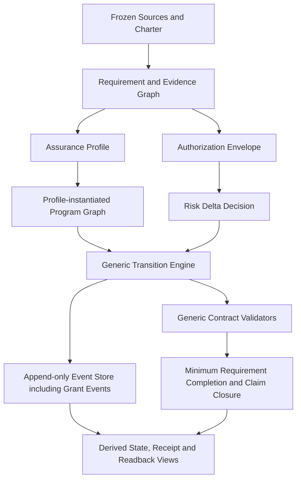

# Harness Foundry v2.9 控制面架构校正与收敛方案

## 0. 文档信息

| 字段 | 内容 |
|---|---|
| 文档状态 | `RELEASE_CLOSURE_CONTROL_PLANE_REMEDIATION_PROPOSED_NOT_FROZEN` |
| 目标版本 | Harness Foundry v2.9 |
| 校正类型 | `CONTROL_PLANE_ARCHITECTURE_CORRECTION_AND_RELEASE_CLOSURE_REMEDIATION` |
| 初始编写日期 | 2026-08-04 |
| 本次修订日期 | 2026-08-05 |
| 当前Program | `PROGRAM-HARNESS-FOUNDRY-V2-9-UPGRADE` |
| 当前Candidate | `Harness_Foundry_v2_9_Start_Package_Candidate_v0_13`；只读构建基线，不是Release Closure |
| 当前Execution Root | `Harness_Foundry_v2_9_Execution_Root_v0_13`；只读运行轨迹，不是最终Human Cost Acceptance |
| 当前Control Plane Epoch | `1` |
| 建议后继Control Plane Epoch | `2`；仅在后续明确REOPEN和Freeze后成立 |
| 当前Requirement Epoch | `12`（Factory SQLite权威状态，`FROZEN`） |
| 建议后继Requirement Epoch | `13`；本次只提案，不创建、不REOPEN |
| 当前Architecture Epoch | `1` |
| 建议后继Architecture Epoch | `2`；仅在Requirement Epoch 13内提议 |
| 当前Factory状态 | revision `90`，`CANDIDATE_READY_FOR_HUMAN_REVIEW`，next intent仅`REOPEN` |
| 当前安全停点 | 正式Event Store revision `24`；三个控制Fixture已PASS，Parent已撤销，无后继Transition |
| 当前发布判断 | `RELEASE_BLOCKED_PENDING_CONTROL_PLANE_REMEDIATION` |
| 适用文档 | `HARNESS_FOUNDRY_V2_9_SEMANTIC_CONFORMANCE_UPGRADE_PLAN.md` |
| 上层参考 | `HARNESS_FOUNDRY_V3_0_FOLLOW_ON_ARCHITECTURE_PLAN.md` |
| 本次Readback | `docs/v2_9_release_closure/V2_9_RELEASE_CLOSURE_CONTROL_PLANE_REMEDIATION_REQUIREMENT_READBACK.proposed.json` |
| 非授权声明 | 本文和本次Readback不REOPEN、不Freeze、不生成Candidate、不创建Execution Root、不启动Driver/Workpack、不授权、不执行、不安装、不发布、不认证 |

本文最初记录Requirement Epoch 8→9的控制面校正；该历史已经推进到Requirement Epoch 12、Candidate v0_13和Event Store revision 24。第1至19节继续保留早期架构决策、证据和迁移理由，不能被改写成当前Runtime事实；第20节以后是本次Release Closure修订。两者冲突时，以第20节以后的当前提案为准。本文不是Factory权威Requirement IR、Grant、Authorization Source、Promotion Receipt、Release Lock或Certificate。

本次操作只更新文档并生成proposal-only Requirement Readback。它不修改`runs/`、SQLite、Frozen Requirement IR、Candidate v0_13、Execution Root v0_13或Event Store，也不会隐式推进Requirement Epoch。

### 0.1 Epoch术语与唯一迁移路径

本文中的三种Epoch必须分开理解：

| Epoch | 中文含义 | 当前值 | 后继值 | 权威位置 |
|---|---|---:|---:|---|
| `requirement_epoch` | 需求冻结代次 | `12` | `13`（仅提议） | Factory SQLite/Event与Requirement Readback |
| `architecture_epoch` | 架构决定代次 | `1` | `2`（仅提议） | 后续Requirement Epoch 13的Architecture Decision Packet/Lock |
| `control_plane_epoch` | Candidate与Runtime控制协议代次 | `1` | `2`（仅提议） | 后续替代Candidate的Program Graph、Policy与Runtime State |

后续若获得明确授权，唯一迁移路径仍是保留`PROGRAM-HARNESS-FOUNDRY-V2-9-UPGRADE`，在同一Factory Program中显式`REOPEN`，使Requirement Epoch从12推进到13；保留原SQLite/Event历史，不另建平行Program。Candidate v0_13与Execution Root v0_13继续只读；后续Candidate版本、输出根和Execution Root在Requirement Freeze前保持未分配。本次修订不执行该`REOPEN`。

## 1. 执行摘要

当前v2.9已经完成一个控制内核构建轨迹，并停在适合Release Closure纠偏的位置：

```text
Candidate v0_13静态校验 = PASS / AUTHORING_ONLY
→ 独立Execution Root v0_13
→ PROFILE_READ_VALIDATION = PASS
→ PROFILE_INTERNAL_STATE = PASS
→ PROFILE_REVERSIBLE_FIXTURE = PASS / ROLLBACK VERIFIED
→ Event 24撤销第三个Parent
→ next_declared_transition = null
→ STOP：CONSTRUCTION_TRACE_COMPLETE_NOT_FINAL_ACCEPTANCE
```

这不是控制Fixture执行失败。当前真实问题是：通用Event/Grant/Transition内核已经出现并完成三类节点轨迹，但语义身份、实现身份和人工授权身份仍会级联；治理恢复仍存在节点专用入口；复杂度预算没有成为Runtime熔断器；产品、安全和发布仍由v2.8固定23步单链承担。直接创建clean acceptance root只会稳定复现这套双轨控制面，不能关闭Release风险。

本次校正采用：

> 保留稳定数据与事务内核，替换控制面；保留当前PASS为只读回归证据，废止其后继执行资格；不新增P0编号，不用更多Gate和Receipt掩盖架构根因。

校正后的v2.9应形成：

```text
Requirement / Evidence Graph
+ Assurance Profile
+ Authorization Envelope
→ Generic Transition Engine
→ Append-only Event Store（含Grant Event子流）
→ Derived Readback and Evidence Views
```

人类批准语义、风险、权限和不可逆影响；机器管理每个Attempt的精确Hash、重试、Evidence和状态推进。Workpack PASS不等于父Requirement关闭，Phase变化不等于人工Gate。

### 1.1 本次属于哪一种升级

本次定义为`CONTROL_PLANE_REFACTOR_INSIDE_VERSION_UPGRADE`，中文是“版本升级范围内的控制面重构”：

- **继续复用**：v2.8已经稳定的canonical JSON/Hash、SQLite Event、CAS、Idempotency、Fencing、Spec Lock、Source Provenance和可移植文件清单能力；
- **需要重构**：固定三工程/20节点拓扑、逐节点Authorization、节点专用Validator、隐式Rule分支以及默认不自动推进的控制路径；
- **不是从零重写**：不手工另造Start Package，不丢弃v2.8代码和历史证据；新Architecture Freeze后仍由Factory编译替代Candidate；
- **也不是原地小修**：控制Trust、授权粒度和Transition语义已经变化，不能继续旧DAG后再渐进补丁。

因此它在产品版本上仍是2.8→2.9升级，在实现方式上是“保留数据与事务内核、重构控制面”。`BASELINE_REUSE_MANIFEST`必须逐组件证明复用、适配、替换或退役，避免重构演变成无边界重写。

## 2. Requirement Epoch 8 / Candidate v0_9历史停点事实

本节保留最初架构校正所依据的v0_9事实，作为历史回归基线，不再表示当前停点。当前事实见第20节。

### 2.1 已完成事实

当前只允许承认以下事实：

| 事实 | 当前值 |
|---|---|
| `last_completed_node` | `SHARED_CONTROL_BASELINE_LOCK` |
| Action Result | `PASS` |
| Transaction | `STATE_COMMITTED` |
| Result SHA256 | `ba9686f95c95ab740c25a1a27ef32b2dd80513eab4f72b3d0e3728b8faa08072` |
| Factory Candidate Content SHA256 | `08c7e4d2579b4a21746f4aaf576092f5fb0d54c31746fa4889c65b819447fee5`；Factory编译输出身份 |
| Portable Candidate Identity SHA256 | `b39380cc3b25ad690995f06cd597c2bd742f366eb1bd23176c41b96b5ccdedd0`；`PORTABLE_FILE_MANIFEST`文件映射的canonical Hash |
| Requirement IR SHA256 | `fdb9551d1e9ef321c83c098d6421dbff60c95c09a0e8c0e06d72a3366c555ae7` |
| Produced Capabilities | `SHARED_CONTROL_BASELINE_LOCK_PASS`、`CHARTER_LOCK_VALID`、`SHARED_PROTOCOL_LOCK_VALID` |
| Active Authorization | 无 |
| Authorization | `CONSUMED` |
| Remaining Transition Budget | `0` |
| Next Fencing Token | `2` |
| Driver Started | `false` |
| Active Workpack | `null` |
| Side Effects Allowed | `false` |
| Current Next Node | `CONTROL_PLANE_REGISTRATION`，仅为Control Plane Epoch 0中的声明，不代表已授权 |

Factory Authoring Readback中的`human_approval_status: PENDING`与v0_9独立Execution Root中已经消费的`START_PACKAGE_HUMAN_APPROVAL`属于两个不同状态机：前者描述Factory Candidate的Authoring投影，后者描述外部Runtime Gate。它们不能互相覆盖，也不能因字段同名而合并。`BASELINE_REUSE_MANIFEST`必须分别绑定二者并标注Authority Scope。

当前v0_9 Runtime Binding只声明`harness-resource://execution`，因此当前事实来源使用以下既有逻辑引用：

- `harness-resource://execution/.harness-foundry/control/PROGRAM_CONTROL_STATE.json`；
- `harness-resource://execution/evidence/engineering_dag/SHARED_CONTROL_BASELINE_LOCK/result.json`；
- `harness-resource://execution/.harness-foundry/control/transactions/SHARED_CONTROL_BASELINE_LOCK.transaction.json`；
- `harness-resource://execution/evidence/engineering_dag/SHARED_CONTROL_BASELINE_LOCK/recovery_receipt.json`。

Control Plane Epoch 1不得在自己的Execution Binding中继续用`harness-resource://execution`指代旧根。Slice A生成的`BASELINE_REUSE_MANIFEST`必须声明新的只读历史命名空间`harness-resource://baseline/v0_9/...`及其Resolver/Binding Receipt，并同时绑定：

- Factory Candidate Content SHA256；
- Portable Candidate Identity SHA256及其算法标识；
- Requirement IR、Result、Transaction、State与Recovery Receipt Hash；
- 文件数量、记录时间、只读策略和失效条件。

Portable Artifact中只保存逻辑URI和Hash，不保存解析后的本机绝对路径。

### 2.2 当前PASS允许证明什么

当前PASS可以作为下列能力的历史回归Fixture：

- 确定性控制Action能够运行；
- Candidate、Command、Authorization和Executor实现Hash可以绑定；
- 一次性Authorization可以消费；
- Fencing Token可以推进；
- Journaled Transaction可以原子提交；
- 声明Crash Point后可以执行Reconciliation；
- 重复副作用计数为0；
- 该Action没有启动Driver或Workpack。

### 2.3 当前PASS不能证明什么

当前PASS不能证明：

- v2.9控制面架构已完成；
- `CONTROL_PLANE_REGISTRATION`可以继续；
- Program Driver已实现或验证；
- Parent Authorization和Derived Attempt已实现；
- Runtime能够自动推进到真实Gate；
- Atom完成度可以从Workpack/Evidence聚合；
- Main、Lab、Linkage拓扑适用于所有Profile；
- v2.9 P0-01至P0-10已经关闭；
- v2.9已发布、安装或认证。

## 3. 为什么必须在此处改架构

### 3.1 冻结Requirement绑定了旧拓扑

当前`ASM-V29-003`把v2.9复合Gate映射到固定v2.8工程拓扑：MB-G0、MB-P1、MB-P2、MB-P3、MB-P4、Main、Lab、Linkage和Release Pipeline。该映射已经通过旧Readback进入冻结Requirement。

现在要把拓扑改成Profile驱动、把逐节点Validator改成通用Transition Engine、把逐Attempt人工授权改成Parent Authorization，属于Architecture和Control Trust语义变化。因此旧Architecture Lock与未消费后继Authorization必须失效；不能把变化描述成普通代码修复。

### 3.2 Candidate仍是混合版本控制面

Candidate v0_9同时存在：

- v2.9 Program和Factory身份；
- `schema_version: 2.8`的Program Automation Policy；
- 固定20节点DAG；
- `automatic_progress_default: false`；
- 每个Mode虽然声明可自动执行，但缺少统一Risk Delta和Derived Grant引擎；
- `dag_status: PLANNED_NOT_EXECUTABLE`；
- v2.8路径/拓扑兼容逻辑与v2.9新合同混合。

兼容输入可以保留2.8 Schema，但v2.9核心输出、控制状态和Claim合同必须使用v2.9身份。Legacy字段只能由Compatibility Adapter读取，不能继续污染新控制内核。

### 3.3 人类授权与机器身份没有彻底分离

当前架构把以下对象绑定得过紧：

```text
Human Decision
Attempt-specific Command Hash
Executor Implementation Hash
Expected Control State Hash
One Transition Budget
One Node Result
```

精确Hash对机器执行是必要的，但不应要求人类为授权范围内的每次Artifact变化重新决定。人类应批准Risk Envelope；机器应在Envelope内派生Attempt级Grant并验证每个字节。

### 3.4 Authority状态存在多重表达

当前状态同时存在`authorization_status`、`registration_authorization_status`、`active_authorization_id`、Grant Receipt和Human Approval字段。它们可以表示不同层次，但当前命名不足以证明哪一个是权威、哪一个是投影。

校正后必须只有一个持久化事实源：append-only Event Store。`GRANTED / ACTIVE / CONSUMED / REVOKED / EXPIRED`以Grant Event子流计算；Grant Ledger、状态文件、Receipt和Readback只作为可重建投影，不能各自形成Authority。

### 3.5 Validator编码了历史执行故事

当前Validator包含大量节点专用`_authorized_*`路径，部分逻辑写死：

- 特定Node；
- 特定Attempt ID；
- 特定Recovery文件名；
- 特定授权文件名；
- 特定一次重试边界；
- 重复的`resolve_ref`、`read_json`、`bound`和`repository_hash`。

这使每次修复都倾向于增加新的函数、Schema、Receipt和Hash链。Validator应验证通用合同和Profile实例，而不是永久保存每次历史事故的程序分支。

## 4. 校正决定与硬边界

### 4.1 核心决定

1. 不执行Candidate v0_9的`CONTROL_PLANE_REGISTRATION`；
2. 不向旧Execution Root写入新状态、Promotion或Supersession Event；
3. 当前Candidate和Execution Root保持Hash稳定，只作为历史证据；
4. 在同一v2.9升级Program中显式`REOPEN`，Requirement Epoch从8推进到9；Architecture和Control Plane分别进入Epoch 1；
5. 如果Factory不能安全表达这条路径，则返回`FACTORY_EPOCH_TRANSITION_UNSUPPORTED`并停机修复Factory；不得在实现阶段自行切换为平行Program；
6. Requirement Epoch 9生成替代Candidate和Execution Root，不覆盖v0_9；
7. 不新增P0编号，不增加平行发布级Gate，但所有变化登记`CORR-29-*` Requirement；
8. 先修生产架构，再写Validator；
9. 校正完成前不开始v3.0 Program或实现高级能力；
10. 校正文档、Readback或代码提交本身都不授权Factory REOPEN、Driver、Workpack或安装。

### 4.2 需要保留的不变量

- v2.8仓库、Spec、SQLite、runs、Candidate和Execution Root零写入；
- v0_9 Candidate和Execution Root零写入；
- canonical JSON、Hash、Event Chain、CAS、Idempotency和Fencing语义不降低；
- Authoring和Runtime权责分离；
- Producer自报、文件存在和Exit Code不能独立关闭Claim；
- Scope、权限、网络、Secret、真实目标和不可逆影响扩大必须返回人工；
- 未知副作用Fail-closed；
- 不复用Requirement Epoch 8的运行状态、旧Authorization、旧Attempt或旧Certificate作为Requirement Epoch 9 Authority；旧Event只作为同一Program内的不可变历史输入；
- Portable Artifact不持久化本机绝对路径；
- Main/Lab/Linkage独立性按Control Domain事实声明，不按项目数量宣称。

### 4.3 明确禁止的校正方式

- 为`CONTROL_PLANE_REGISTRATION`再补一个专用Authorization Runner；
- 新增更多`_authorized_main_*`、`_authorized_lab_*`或`_authorized_linkage_*`函数；
- 只增加Validator让旧Producer输出看起来通过；
- 修改旧Result、Transaction、Recovery Receipt或Event Chain；
- 重置Transition Budget后继续Control Plane Epoch 0；
- 把多个旧Grant拼成Parent Authorization；
- 用“自动Review”替代真实Authority或扩大权限；
- 为每个新概念新增独立CLI、人工文件或发布Gate；
- 把v3.0高级能力作为v2.9发布阻塞项；
- 用文档PASS声明代码、Runtime或认证完成。

## 5. 校正后的最小控制架构

### 5.1 总体结构



### 5.2 权威层与投影层

持久化事实的唯一Authority是单一append-only Event Store。权威事件可以引用不可变Artifact身份，但不得再建立第二个可独立写入的状态库。权威层包括：

- Frozen Requirement/Architecture/Policy；
- Event Store中的Program、Transition、Grant、Completion和Invalidation事件；
- immutable Result/Evidence identity；
- Profile-instantiated Program Graph；
- Requirement/Claim Completion decisions。

以下全部为投影：

- `PROGRAM_CONTROL_STATE.json`；
- Human Readback；
- Status页面；
- Promotion摘要；
- Completion Matrix；
- Grant Ledger视图；
- Digest和Dashboard。

投影可以删除并从Event重建，不能反向修改权威Event。文档中的“Grant Ledger”专指Grant Event子流的可重建逻辑账本，不是第二SQLite、第二Event Store或独立写Authority。

## 6. 五个核心合同

### 6.1 Requirement and Evidence Graph

统一表示：

```text
Source Locator
→ Atom
→ Subrequirement
→ Acceptance / Negative / Boundary Case
→ Workpack Obligation
→ Artifact Obligation
→ Evidence Class / Oracle
→ Claim Set
```

最低字段：

- `atom_id`；
- `subrequirement_id`；
- `source_locator`与`source_sha256`；
- `requirement_kinds[]`；
- `verification_obligations[]`；
- `lifecycle_scopes[]`；
- `criticality`；
- `case_refs[]`；
- `workpack_refs[]`；
- `evidence_obligation_refs[]`；
- `invalidation_dependencies[]`。

### 6.2 Assurance Profile

Assurance Profile根据风险确定拓扑，不直接根据版本或案例名称决定项目数量。

最低输入：

- 外部影响与不可逆性；
- 数据敏感度；
- 网络、Secret和外发；
- 语义不确定性；
- 恢复难度；
- 认证等级；
- 共同失效风险；
- 成本和人工注意力上限。

示例Profile：

| Profile | 默认拓扑 |
|---|---|
| `LOCAL_REVERSIBLE` | 单仓、单状态根、内部独立Validator；无固定Lab/Linkage工程 |
| `TEAM_TOOL_MEDIUM_RISK` | Main与只读Validation责任域分离；按Claim启用Linkage |
| `EXTERNAL_SIDE_EFFECT_HIGH_RISK` | 独立Execution Root、Credential、Validator/Signer和必要Lab |

Main、Lab和Linkage仍可存在，但必须由Profile和Claim激活；不再是所有Program的固定拓扑。

#### 6.2.1 Control Domain Contract

“独立”不能由工程名称、CLI数量或更换Prompt推断。每个需要Oracle或认证的Claim必须实例化`CONTROL_DOMAIN_CONTRACT`，至少绑定：

```text
claim_id
assurance_level
producer_domain_id
oracle_domain_id
signer_id
producer_implementation_sha256
oracle_implementation_sha256
credential_scope_ids[]
workspace_binding_ids[]
state_store_ids[]
parent_task_ids[]
blind_input_policy
common_mode_failure_classes[]
```

最低执行规则：

1. 同一Chat、同一顶层Task、同一Credential、同一State Store或同一Validator实现只能声明`COORDINATED_SEPARATION`，不能签发独立认证；
2. `INDEPENDENT_INTERNAL_CERTIFICATION`要求Producer与Oracle使用独立顶层Task、Workspace/State、Credential/Signer和不同Validator实现；
3. 父协调任务可以调度和汇总，但不能替高风险Claim代签；
4. 无法证明独立性时降级Claim，不得用“启动了另一个CLI”补齐；
5. Profile只选择已冻结的控制域模板；v2.9不实现动态Topology Optimizer。

### 6.3 Authorization Envelope and Grant Ledger

Parent Authorization冻结：

- 允许写入的逻辑Root；
- 命令类别；
- 权限、网络、Secret和外发；
- 最大时间、Transition、Attempt和修复预算；
- 允许的副作用等级；
- 停止Gate；
- 可自动恢复范围；
- 不可扩大项。

机器为每次执行派生：

```text
Derived Grant
= parent_authorization_id
+ parent_authorization_sha256
+ attempt_id
+ transition_contract_sha256
+ input_state_sha256
+ command_sha256
+ executor_sha256
+ risk_policy_ref
+ risk_policy_sha256
+ risk_delta_sha256
+ scope_subset_proof_sha256
+ cumulative_budget_snapshot
+ expiry
+ revocation_epoch
+ fencing_token
```

Derived Grant的派生必须由确定性Risk Policy执行，并同时满足：

1. Parent处于`GRANTED`或允许派生的`ACTIVE`状态，未过期、未撤销、未耗尽；
2. Child Expiry不晚于Parent Expiry；
3. Child的写Root、命令类别、权限、网络、Secret、外发、副作用等级和Stop Gate都是Parent的子集或等值，不能做集合并集或风险降级；
4. 单次与累计Transition、Attempt、修复、时间和成本预算都未超过Parent上限；
5. 并发执行受Lease和Fencing约束，Stale Token不能消费Grant；
6. Parent撤销、过期或控制面失效时，所有未消费Child立即级联失效；
7. Risk Policy无法形成确定结论时返回`RISK_DELTA_UNKNOWN`并停止，不能默认放行。

Artifact Hash变化但上述规则证明风险、命令类别和Scope仍在Envelope内时，机器重新派生Grant，不请求人工。每次派生生成Scope Subset Proof和Risk Decision Receipt。

Grant生命周期的唯一权威记录是Event Store中的Grant Event子流：

```text
PROPOSED
→ GRANTED
→ ACTIVE
→ CONSUMED

任意阶段可进入：REVOKED / EXPIRED / INVALIDATED
```

`Grant Ledger`是该子流的可重建查询视图。它不能脱离Event Store独立写入、修复或创造Grant。

### 6.4 Generic Transition Contract and Engine

每个Node不再拥有专用Validator函数，而实例化同一Transition Contract：

```text
transition_id
node_kind
precondition_claims[]
input_refs[]
allowed_read_roots[]
allowed_write_roots[]
required_authorization_class
command_contract
result_schema
evidence_obligations[]
decision_policy_ref
decision_policy_sha256
rule_language_id
rule_language_version
rule_evaluator_ref
rule_evaluator_sha256
declared_input_schema_ref
success_rule_ids[]
failure_rule_ids[]
retry_policy
checkpoint_policy
invalidation_rule_ids[]
next_transition_rule_ids[]
rule_precedence_table
conflict_policy
unknown_policy
decision_receipt_schema_ref
```

v2.9的Rule不能只是自然语言标签。最低可执行语义为：

1. Rule只读取`declared_input_schema_ref`允许的、Hash绑定的输入；
2. 同一输入、Policy、Evaluator和Rule版本必须产生同一Decision；
3. 优先级固定为Safety/Authority > Frozen Charter > Frozen Requirement > Architecture/Policy > Transition局部规则；
4. 多条Rule冲突时按`rule_precedence_table`处理；仍不能消解则返回`POLICY_CONFLICT`并停止；
5. 缺少输入、Schema不兼容或无法求值时返回`POLICY_UNKNOWN`，不得让模型临时补规则；
6. Semantic Decision Slot可以提出候选解释，但不能直接改变权威State；候选必须进入已有Rule或Human Decision Packet；
7. 每次Decision Receipt记录输入Hash、命中Rule ID、Evaluator Hash、结果、原因码和下一Transition选择。

Generic Transition Engine负责：

- CAS和Fencing；
- Grant验证与消费；
- Idempotency；
- Command执行；
- Result Schema验证；
- Evidence收集；
- Event追加；
- State投影重建；
- Retry/Resume；
- Risk Delta判断；
- 自动推进到真实Gate。

项目差异进入Profile或Transition数据，不进入核心Python分支。

### 6.5 Minimum Requirement Completion and Invalidation

v2.9只实现单Program内、显式声明的最小Requirement完成合同，不实现自动语义拆解、全局Evidence反向索引、Readiness Matrix或Coverage Delta优化器。

Requirement状态固定为：

```text
NOT_APPLICABLE
PLANNED
PARTIAL
SATISFIED
BLOCKED
INVALIDATED
```

验证深度作为独立字段`verification_level`记录，例如`STATIC / TEST / FIXTURE / LIVE / INSTALLED`；不能把“已实现”“已验证”“已安装”“已接受”“已认证”混成一个单向状态枚举。

最低完成规则：

```text
applicability_decision = APPLICABLE
AND all explicitly declared mandatory subrequirements satisfied
AND all routed required Workpacks valid
AND all applicable Cases pass
AND all required Evidence and Oracles pass
AND no blocking Finding or invalidated dependency remains
```

单个Workpack PASS只关闭该Workpack的Success Rule，不能单独关闭父Requirement。Evidence必须直接保存其Requirement/Case/Claim引用；当已声明的`invalidation_dependencies[]`变化时，Event Store追加Invalidation Event并重新打开受影响Requirement。

下一Workpack只按冻结的Release Critical Path、显式依赖和阻塞关系选择。自动语义分解、跨图Evidence Reverse Index、单Program Readiness Matrix和`CHARTER_COVERAGE_DELTA`优先级优化保留到v3.0，不作为v2.9 Release Gate。

## 7. 人工决策与自动推进校正

### 7.1 统一Decision分类

| 分类 | 条件 | 处理 |
|---|---|---|
| `MACHINE_CONTINUE` | Hash、Schema、Evidence、授权内修复、幂等重试、Phase推进 | 自动执行并记录Receipt |
| `MACHINE_REVIEW_THEN_CONTINUE` | 新颖Finding、Oracle分歧、抽样命中，但可由既有Policy确定关闭 | 自动Review；关闭后继续 |
| `HUMAN_AUTHORITY_REQUIRED` | Requirement/Architecture含义、权限、外发、不可逆影响、Waiver或预算上限变化 | 生成Decision Packet并停止 |
| `HARD_STOP_UNKNOWN_SIDE_EFFECT` | 外部副作用状态未知且无法安全Reconcile | Fail-closed，人工决定处置 |

“进入新Phase”“新增内部Artifact”“代码Hash变化”“换用已授权工具”“自动Review完成”都不能单独产生人工Gate。

### 7.2 Risk Delta规则

只有以下变化要求新的人类授权：

1. Requirement、Charter或Architecture语义变化；
2. 写Root、权限、网络、Secret、外发或真实目标扩大；
3. Driver、Policy Engine、Validator Trust或Signer边界变化；
4. 新增安装、删除、发布等不可逆或外部影响；
5. Waiver、Policy Unknown、未知副作用或无法关闭的独立Validator分歧；
6. 超出Parent Authorization预算上限。

以下不要求新的人类授权：

- 同一Envelope内的目标代码修复；
- Attempt Hash和Artifact Hash更新；
- 已声明的暂时错误重试；
- 无副作用的只读复验；
- Evidence和Receipt收口；
- Derived Grant生成；
- 无Risk Delta的下一个Transition。

### 7.3 Human Decision Packet

每次人工请求只展示：

```text
decision_required
why_human_authority_is_required
recommended_option
at_most_two_material_alternatives
authority_and_risk_delta
budget_and_external_effect_delta
default_stop_or_reversible_fallback
supporting_evidence_refs
```

用户不输入子Hash、不阅读完整Trace、不跨Task搬运Artifact，也不批准机器内部实现细节。

### 7.4 Human Cost Baseline and Acceptance

“减少人工”必须由Event自动计数，不能依赖Review者主观判断。Slice A先从当前v0_9历史事件生成只读`HUMAN_COST_BASELINE.json`；新架构使用同一计数Schema输出`HUMAN_COST_RESULT.json`。

最低指标：

```text
human_decision_count
manual_hash_input_count
human_interruptions_to_completion
human_wait_duration_ms
auto_transition_count
derived_grant_count
bounded_retry_count
resume_count
stop_reason_counts
```

校正纵向场景的硬验收为：

- 一个Architecture Freeze；
- 一个Parent Risk Authorization；
- `manual_hash_input_count = 0`；
- 至少三个不同Node Kind自动推进；
- 至少一次授权围栏内的安全重试或恢复不增加人工Gate；
- Phase、Workpack、内部Review、Artifact Hash变化和Evidence收口产生的额外人工决策为0；
- 只在真实Risk Delta、声明Stop Gate或未知副作用处停止。

历史v0_9基线用于说明改善幅度，不作为允许新架构保持高人工成本的上限；上述硬验收优先。

## 8. 从v3.0下沉到v2.9的内容

下沉原则：只有“没有它就无法形成最小可信、低人工闭环”的能力进入v2.9；学习型、跨Program、跨组织和平台优化继续留在v3.0。

| v3.0内容 | v2.9下沉形式 | 归属P0 | 不下沉部分 |
|---|---|---|---|
| Human Attention Governor | 确定性Risk Decision Gate与四分类Decision | P0-05/P0-06 | 学习型注意力优化 |
| Human Decision Packet | 单一可读风险差量包 | P0-05 | 个性化/学习型呈现 |
| Human Cost Non-regression | 常规人工Gate数量不增加、记录中断和等待 | P0-06 | 全局成本优化模型 |
| Capability Activation Profile | 静态Assurance Profile决定必要拓扑与独立域 | P0-03/P0-09 | 学习型动态Profile |
| Minimum Requirement Completion | 显式子要求、Applicability、Workpack/Case/Evidence的最小`ALL_OF`聚合与直接失效传播 | P0-08 | 自动语义分解、Evidence Reverse Index、Readiness Matrix、Coverage Delta优化 |
| Capability Lifecycle基础规则 | 未激活能力不扩大权限或产生Gate | P0-03/P0-05 | Shadow/Canary平台治理 |

下沉不新增P0-11或P0-12；通过更新现有P0验收和Schema实现。

## 9. 继续留在v3.0的能力

以下能力不得成为v2.9校正或发布Gate：

- Adaptive Expert Intent和复杂EVPI；
- 自动Architecture Synthesis与Topology Optimizer；
- 自动Atom Semantic Decomposition和跨Program语义聚类；
- 独立Evidence Reverse Index、Readiness Matrix和Coverage Delta优先级优化；
- 从任意自然语言自动生成权威Policy；
- 多主机Distributed Durable Orchestration；
- 学习型Adaptive Review/Cost Router；
- L4外部组织、多Provider和外部Signer网络；
- 完整OCI、SBOM、SLSA、in-toto与透明日志平台；
- MCP/A2A多生态联邦；
- 跨Program Observability、聚类和学习；
- 自动Case-to-Core Promotion；
- 大规模Canary Property Matrix；
- 平台规则学习与自动下线优化。

v3.0只承接“适应、规模、联邦、学习”，不重新定义v2.9 Authority、Authorization、Transition、Evidence或Claim Closure语义。

## 10. 现有P0与显式校正Requirement映射

不改变P0-01至P0-10数量，但不能用“不新增P0编号”隐藏架构与验收变化。每项校正先登记版本化`CORR-29-*` Requirement，再映射到原P0：

| P0 | 保留目标 | 校正后的追加验收 |
|---|---|---|
| `P0-01` Version Isolation | v2.8零写入与v2.9独立根 | v0_9作为只读历史根；Control Plane Epoch 1不覆盖旧Candidate/Execution |
| `P0-02` Requirement Lock | Requirement可回读并冻结 | Architecture Correction使旧Lock失效，必须生成Requirement Epoch 9 Readback |
| `P0-03` Architecture Lock | Capability具有生产路径 | Program Graph由Assurance Profile实例化；核心不硬编码三项目和固定节点 |
| `P0-04` Charter Enforcement | Clause全量处置和PEP | Decision Policy绑定通用Transition Engine，不为节点复制PEP |
| `P0-05` No Manual Hash | 人类只确认可读风险 | Parent Authorization与Derived Grant可执行；Grant Event子流是Grant生命周期权威 |
| `P0-06` Auto Progress | 自动运行到真实Gate | 一个入口跨多个Transition和一次安全重试；Human Cost硬指标通过 |
| `P0-07` Recoverable Stop | Checkpoint/Resume | 通用Engine覆盖Crash Point；不为节点新增Recovery实现 |
| `P0-08` Applicable Evidence | 按Requirement生成Evidence | 显式子要求、Applicability、最小Completion Record和直接失效传播；不引入Readiness/Coverage平台 |
| `P0-09` Honest Independence | 不伪装独立性 | Assurance Profile按Claim选择Control Domain，不用项目数量代替独立性 |
| `P0-10` Portability | Logical Resource和clean clone | v2.8 Schema只在Adapter内；v2.9核心输出不得回落到2.8身份 |

### 10.1 Architecture Correction Requirement Registry

| Correction ID | 必须关闭的问题 | 映射P0 |
|---|---|---|
| `CORR-29-001` | 区分Requirement/Architecture/Control Plane Epoch并锁定同一Program REOPEN路径 | P0-01/P0-02 |
| `CORR-29-002` | Decision Policy和Rule Evaluator成为Hash绑定、可执行、Fail-closed合同 | P0-03/P0-04 |
| `CORR-29-003` | 单一Event Store Authority及可重建Grant/State/Readback投影 | P0-04/P0-07 |
| `CORR-29-004` | Parent Authorization、Derived Grant、Risk Delta和撤销/预算/租约规则可执行 | P0-05/P0-06 |
| `CORR-29-005` | Human Cost指标与固定纵向场景达到硬阈值 | P0-05/P0-06 |
| `CORR-29-006` | 最小Requirement Completion与直接Invalidation，不下沉3.0平台能力 | P0-08 |
| `CORR-29-007` | Control Domain Contract证明或诚实降级独立性 | P0-09 |
| `CORR-29-008` | 历史基线双Hash、逻辑URI、Resolver和clean-clone绑定无本机路径 | P0-01/P0-10 |

旧P0文本保持历史可读；Requirement Epoch 9通过上述Correction ID追加或替代Acceptance，不回写Epoch 8 Frozen IR。

## 11. 源码处置矩阵

| 组件 | 处置 | 校正责任 |
|---|---|---|
| `models.py` | `REUSE_AND_EXTEND` | 保留canonical JSON/Hash；新增Transition、Grant、Decision Policy和最小Requirement Completion模型 |
| `store.py` | `REUSE_AND_EXTEND` | 保留单一SQLite Event/CAS/Idempotency；增加Grant/Completion Event，不增加第二状态库 |
| `spec_lock.py` | `REUSE_AND_VERSION` | 保留v2.8规范身份；增加v2.9 Extension身份，不混写 |
| `traceability.py` | `EXTEND_MINIMALLY` | 统一Requirement→Transition→Evidence→Claim直接绑定与声明式失效；不创建独立Reverse Index/Readiness平台 |
| `service.py` | `REFACTOR_BEHIND_COMPATIBILITY_ENTRYPOINT` | Authoring入口保留；内部改为advance-until-real-gate和Risk Decision |
| `constants.py` | `RETIRE_PROGRAM_SPECIFIC_TO_PROFILE_DATA` | 移除核心中的固定项目、Node和Workpack拓扑 |
| `compiler.py` | `SPLIT` | 分离IR编译、Profile实例化、Renderer、Portability和Compatibility Adapter |
| `validator.py` | `REPLACE_BESPOKE_PATHS_WITH_GENERIC_VALIDATORS` | 移除节点专用历史故事；验证Schema、Transition、Grant、Evidence和Profile |
| `semantic_contracts.py` | `ABSORB_INTO_REQUIREMENT_EVIDENCE_GRAPH` | 保留Artifact Obligation价值，增加最小Completion和直接Invalidation |
| `resources/shared_control_baseline.py` | `REUSE_AS_REGRESSION_FIXTURE_THEN_GENERALIZE` | 当前Action保留为Golden Fixture；通用事务能力迁入Transition Engine |
| `cli.py` | `KEEP_COMPACT` | 组合入口和`--detail`，不为每个检查增加命令 |

### 11.1 建议模块边界

文件名是建议，不是必须逐文件照搬：

```text
core/
  canonical.py
  events.py
    grants.py
    transitions.py
    decision_policy.py
    evidence_graph.py
  assurance_profile.py

adapters/
  v28_compatibility.py

renderers/
  start_package.py

validators/
  schema.py
  transition.py
  evidence.py
  portability.py
```

必须按责任拆分，不得只是把13,000行Validator机械切成多个同样耦合的文件。

## 12. 删除预算与反膨胀门

架构校正的成功不能用新增文件和测试数量衡量。每个Implementation Slice必须提交Deletion/Retirement说明。

硬规则：

1. 不新增节点专用`_authorized_*`函数；
2. 不在核心代码写死Attempt ID、Grant ID或具体Receipt文件名；
3. 不在核心常量写死Main/Lab/Linkage固定拓扑；
4. 重复`resolve_ref`、`read_json`、`bound`和`repository_hash`收敛为共享实现；
5. 新增通用代码必须替代至少一类专用路径；
6. 每个Slice由脚本记录`bespoke_branches_retired`、`duplicated_contracts_removed`、`manual_actions_removed`和`legacy_paths_retired`；原始行数只作附加观察；
7. 新通用实现未实际退役任何专用分支、重复合同或人工动作时，该Slice不能宣称反膨胀完成；
8. 兼容Adapter有明确Sunset条件，不能永久双轨；
9. 新Artifact优先进入现有逻辑Bundle，不新增操作者Bundle或人工Gate；
10. Validator增长不能关闭Producer根因。

禁止让Review者手工统计行数。反膨胀报告由代码清单和测试自动生成，必须证明专用分支、重复合同和人工动作持续减少。

## 13. 最小实施切片

本方案定义四个实现切片，不预先创建更多Workpack ID。Factory在新Architecture Lock后把切片映射到最小Workpack集合。

### Slice A：Epoch与Architecture Correction

目标：重新打开Requirement/Architecture，不执行Runtime。

输出：

- 当前v0_9 Snapshot/Hash Readback；
- `BASELINE_REUSE_MANIFEST`；
- `HUMAN_COST_BASELINE`；
- 更新后的P0 Acceptance；
- Assurance Profile Schema；
- Control Domain Contract Schema；
- Control Kernel Architecture Lock；
- v3→v2.9下沉Disposition；
- Requirement Epoch 9 Invalidation Plan。

完成条件：一个可读Architecture Decision Packet准备完成，等待明确Freeze；无Driver、Workpack或Target代码执行。

### Slice B：Generic Control Kernel

目标：实现Event/Grant/Transition通用内核。

输出：

- Grant Ledger；
- Authorization Envelope；
- Risk Delta Decision；
- Generic Transition Contract；
- Executable Decision Policy/Rule Evaluator Contract；
- CAS/Fencing/Idempotency/Checkpoint合同；
- State Projection Rebuilder；
- v2.8兼容Adapter。

完成条件：至少三种不同Node Kind使用同一Engine：只读验证、仅内部状态提交、带一次可恢复Fixture副作用的有界Transition；无节点专用授权Validator，Rule Decision均生成可重建Receipt。

### Slice C：Minimum Requirement/Evidence Completion

目标：把显式Requirement/Subrequirement、Workpack、Case、Evidence和Claim形成最小可信闭环，不构建3.0平台能力。

输出：

- Explicit Subrequirement Binding；
- Applicability Decision Record；
- Minimum Requirement Completion Record；
- Direct Evidence/Case/Claim References；
- Declared Dependency Invalidation Event。

完成条件：必需子要求部分实现、错误Applicability、陈旧Evidence和错实例Evidence反例全部Fail-closed；不要求自动语义拆解、Readiness Matrix或Coverage Delta。

### Slice D：Profile-driven Vertical Slice

目标：生成替代Candidate并用一个纵向路径证明架构。

输出：

- Profile实例化Program Graph；
- 替代Candidate；
- 独立Execution Root；
- Parent Authorization派生多个Grant的Trace；
- 一次安全修复/重试；
- Checkpoint/Resume；
- 最终Architecture/Runtime Readback。

完成条件：一个Parent Authorization覆盖多个Transition和一次安全重试；只在真实Risk Delta或声明Stop Gate停止。

## 14. 测试策略

### 14.1 单元测试

- canonical Grant/Transition/Evidence Hash；
- Rule precedence、Policy Conflict与Policy Unknown fail-closed；
- Decision Receipt确定性重建；
- Risk Delta相等与扩大判断；
- Derived Grant不能扩大Parent Scope；
- Parent撤销/过期后的Derived Grant级联失效；
- Grant状态转换与重复消费拒绝；
- Profile到Program Graph实例化；
- Minimum Requirement Completion `ALL_OF`；
- 声明式Dependency Invalidation传播；
- Projection从Event重建；
- v2.8 Compatibility Adapter只读行为；
- Logical Resource Runtime Binding。

### 14.2 对抗测试

1. Target代码Hash变化但仍在Parent Scope内，应自动派生Grant；
2. 写Root、网络或Secret扩大，应停止并请求人工；
3. Stale/Consumed/Revoked Grant应被拒绝；
4. Attempt重放不得重复副作用；
5. Crash发生在Result、Event和State Commit各边界，应可Reconcile；
6. Workpack PASS但缺少Negative Case，不得关闭父Requirement；
7. 同一Evidence关闭两个不等价子要求，应被拒绝；
8. 旧Candidate或旧安装实例Evidence不得关闭Requirement Epoch 9；
9. Profile未激活Lab时不得生成空壳Lab链；
10. 低风险Profile不应被强制生成三项目拓扑；
11. `NOT_APPLICABLE` Requirement不得生成空壳Workpack；缺失Mandatory Subrequirement必须阻塞；
12. State投影删除后应可从Event完整重建；
13. Projection字段冲突不能创造Authority；
14. Legacy 2.8字段不能泄漏到v2.9核心发行物；
15. Validator-only修改不能关闭缺失Producer输出。

### 14.3 纵向E2E

纵向E2E分为两个授权边界：

1. **Architecture Correction Authoring E2E**：在Factory仓库内只运行本地合成Fixture和模拟Event/Grant，不消费真实用户Authorization，不启动Candidate Driver/Workpack；终点是替代Candidate静态Readback。
2. **Runtime Release E2E**：仅在替代Candidate进入独立Execution Project并获得后续Parent Risk Authorization后运行。它不是本次文档修订或Architecture Authoring授权的一部分，但最终v2.9 Release Closure必须完成。

Runtime Release最小E2E必须证明：

```text
Requirement Epoch 9 Architecture Readback
→ one Architecture Freeze
→ one Parent Risk Authorization
→ Derived Grant A
→ Transition A PASS
→ Derived Grant B
→ Transition B temporary failure
→ bounded repair/retry without human
→ Transition B PASS
→ Checkpoint/Resume
→ Minimum Requirement Completion update
→ stop at declared real Risk Gate
```

Authoring测试中的“Parent Authorization”和“Derived Grant”只能是显式标注`SYNTHETIC_FIXTURE_NOT_AUTHORITY`的测试对象，不能被运行时消费或写入真实Execution Root。

### 14.4 非回归

- v2.8既有测试保持PASS或有显式Supersession理由；
- 当前Shared Control Baseline成功、重放和Crash Fixture保持PASS；
- v0_9 Candidate/Execution关键Hash前后不变；
- clean clone、随机路径、不同用户名、隔离HOME和缺失可选插件测试通过；
- Source、Factory、Candidate、Execution和Installed Target身份不混淆。

## 15. 校正发布验收

### 15.1 Architecture

- [ ] v2.9核心输出使用明确2.9 Schema身份；
- [ ] v2.8字段只由Compatibility Adapter读取；
- [ ] Program Graph由Assurance Profile实例化；
- [ ] 核心不硬编码固定三项目和完整20节点拓扑；
- [ ] Transition Engine可以承载至少三种Node Kind；
- [ ] Decision Policy、Rule Evaluator、优先级、Conflict/Unknown语义与Decision Receipt均Hash绑定；
- [ ] 新代码没有新增节点专用授权Validator；
- [ ] Producer根因没有被Validator-only修复冒充关闭。

### 15.2 Authorization and Human Attention

- [ ] 一个Parent Authorization可以派生多个Attempt Grant；
- [ ] 用户不输入或逐项核对子Hash；
- [ ] 同Scope Artifact变化不产生人工Gate；
- [ ] Risk Delta、不可逆影响和未知副作用必然停止；
- [ ] Phase、Workpack、内部Review和Evidence收集不产生人工Gate；
- [ ] Event Store中的Grant Event子流是Grant生命周期唯一Authority，Grant Ledger投影不产生Grant；
- [ ] 固定纵向场景满足一个Architecture Freeze、一个Parent Risk Authorization、零手工Hash和零内部流程附加人工Gate；
- [ ] Human Cost指标由Event自动生成且可重建，不要求Review者手工计数。

### 15.3 Evidence and Completion

- [ ] 每个Requirement可回读到显式子要求、Case、Workpack和Evidence；
- [ ] Workpack PASS不能单独关闭父Requirement；
- [ ] Minimum Requirement Completion按Applicability执行`ALL_OF`；
- [ ] 陈旧、错实例和失效Evidence不能关闭当前Claim；
- [ ] 自动语义分解、Reverse Index、Readiness Matrix和Coverage Delta未被实现或写成v2.9 Release Gate。

### 15.4 Migration and Portability

- [ ] v2.8和v0_9历史根零写入且Hash稳定；
- [ ] 旧Grant、Attempt和State不作为Requirement Epoch 9 Authority；
- [ ] 新Candidate、Execution Root和State独立；
- [ ] 所有Portable Artifact只使用逻辑Resource和声明的Runtime Binding；
- [ ] clean clone和第二随机根验证通过；
- [ ] Compatibility Adapter具有Sunset条件和删除测试。

### 15.5 Operational Closure

- [ ] Source、Schema、代码、测试、Fixture、Evidence和Readback Hash绑定；
- [ ] Unit、Adversarial、E2E、Spec Lock、Skill和Git Hygiene检查通过；
- [ ] 当前校正只生成替代Candidate，不自动启动Driver；
- [ ] 新Candidate进入明确Architecture/Human Readback Stop；
- [ ] 未实现v3.0能力不阻塞v2.9；
- [ ] 没有安装、发布或认证的虚假声明。

## 16. 迁移与回退

### 16.1 迁移顺序

```text
0. Freeze v0_9 history and capture hashes
1. Explicitly REOPEN the same Program: Requirement Epoch 8 → 9
2. Produce Architecture Correction Readback
3. Human freezes corrected Architecture once
4. Implement Generic Control Kernel
5. Add v2.8 Compatibility Adapter
6. Add Minimum Requirement Completion and direct Invalidation
7. Instantiate one Profile-driven vertical slice
8. Generate replacement Candidate and isolated Execution Root
9. Run static, adversarial and no-side-effect validation
10. Stop at corrected Candidate Readback
11. Later Parent Authorization may run to a real Risk Gate
```

### 16.2 回退原则

如果校正失败：

- Requirement Epoch 9写入自己的Failure Evidence；
- 不恢复Control Plane Epoch 0的执行资格；
- 不修改v0_9历史；
- 不把校正失败描述成当前Shared Control Baseline失败；
- 可以继续修复Requirement Epoch 9，或显式终止v2.9升级；
- 只有经新Readback确认旧架构仍满足校正Requirement时才可重新讨论旧路径，不能默认回退。

### 16.3 Compatibility Adapter Sunset

满足以下条件后删除Legacy控制路径：

1. v2.8输入兼容Fixture全部由Adapter通过；
2. 新Engine完成至少一个非来源Profile；
3. 旧节点专用Validator没有生产消费者；
4. clean clone和回滚验证通过；
5. 删除旧路径后测试仍可独立验证历史Artifact；
6. Release Lock明确记录Retired Paths。

## 17. 下一次人工授权范围模板

以下只是人类可读模板，不是有效Authorization字符串，不含Challenge或Grant Hash。

```text
ACTION:
  V2_9_ARCHITECTURE_CORRECTION_AUTHORING_ONLY

  ALLOW:
    - revise v2.9 Requirement and Architecture documents
    - REOPEN the same Program from Requirement Epoch 8 to Requirement Epoch 9
    - create Architecture Epoch 1 and Control Plane Epoch 1 inside Requirement Epoch 9
  - implement the generic control kernel in the v2.9 Factory repository
  - create local isolated fixtures and tests
  - generate a replacement Candidate and static Readback
  - preserve and reference v0_9 evidence read-only

DENY:
  - execute CONTROL_PLANE_REGISTRATION from Candidate v0_9
  - mutate Candidate v0_9 or Execution Root v0_9
  - start any old or new Program Driver
  - execute Main, Lab or Linkage Workpacks
  - use network, external services or undeclared plugins
  - install, publish, certify or touch a real target
  - reuse consumed Grant or old runtime state as new Authority

STOP:
  CORRECTED_V2_9_CANDIDATE_READY_FOR_ARCHITECTURE_AND_RISK_READBACK
```

真正执行前，Factory必须根据当时Source、State、Candidate和Scope生成新的机器Authorization Bundle和可读Risk Delta Packet。用户不应手工构造或复制子Hash。

## 18. Requirement Epoch 8→9历史立即动作（已完成或被后续Epoch取代）

本节是最初校正阶段的执行顺序，不能再作为当前操作清单。当前立即动作见第25节。

在任何后继Runtime授权前按以下顺序处理：

1. 等待用户明确要求Factory对当前Program执行`REOPEN`；本文修订本身不等于REOPEN授权；
2. REOPEN后由Factory创建Requirement Epoch 9，不得创建Requirement Epoch 1或平行Program；
3. 只读回读当前v0_9 Result、Transaction、State、Factory Content Hash和Portable Candidate Identity；
4. 生成`BASELINE_REUSE_MANIFEST`，声明历史根Resolver，并逐组件标记`REUSE / ADAPT / REPLACE / RETIRE`；
5. 生成`HUMAN_COST_BASELINE`和`CORR-29-001`至`CORR-29-008`的Traceability；
6. 将`ASM-V29-003`标记为`SUPERSEDED_BY_PROFILE_DRIVEN_TOPOLOGY_PROPOSAL`，但不直接修改旧Frozen IR；
7. 在Requirement Epoch 9中重写相关P0 Acceptance，并明确3.0保留项；
8. 输出单一Architecture Decision Packet；
9. 等待明确Architecture Freeze；
10. Freeze后才开始控制内核实现；
11. 实现完成后生成替代Candidate；
12. 停止在新的Candidate Readback，不自动启动Driver。

## 19. 最终原则

```text
Preserve exact machine identity; authorize human risk envelopes.
Phase changes do not create human gates.
Workpack PASS does not close a parent Requirement.
Profiles instantiate topology; core code does not hardcode projects.
The append-only Event Store is authoritative; Grant Ledger and other views are rebuildable.
Generic contracts replace incident-specific validators.
Every correction must retire bespoke paths, not only add new ones.
v2.9 closes the minimum trustworthy loop.
v3.0 remains adaptive, cross-program, federated and optional.
The v0_9 and v0_13 PASS traces are preserved as evidence, not promoted as release closure.
```

## 20. Release Closure当前权威基线

以下事实来自Factory SQLite只读Readback和v0_13独立Execution Root只读状态；它们只用于编写本提案：

| 事实 | 当前值 | 允许证明 |
|---|---|---|
| Factory revision | `90`；state Hash `39255afdb44171fba355c8e313f87fd5d31ca5f6b89b8ad54d8f6e718e7f8166` | Authoring历史完整，next intent仅`REOPEN` |
| Requirement | Epoch `12`，`FROZEN`，IR SHA256 `b56e075f193ad64e2781069bb592e02f3c6e261b864b9bbf2d94dff1a42ce79e` | v0_13生成输入已冻结；不能被本提案原地修改 |
| Candidate | v0_13；Factory content SHA256 `af8285316fa4b2c28608187b91beba49466dc180bc5dcbfebf3a2d2d9c6f97c0`；259个文件 | Candidate静态合同与Authoring校验PASS |
| Runtime Candidate tree | `fae5de7fd7a2e88402b73a7f870eb567dd1eaca21e84a481a7a27cdc8125a158` | 独立Execution绑定了哪一份Candidate字节 |
| Event Store | revision `24`；last event Hash `e29f007a5046e35619cd2910dbed62f09327a9bbe7552072f50bda4dc5a8ce57` | 三个控制Fixture已提交，第三个Parent已撤销 |
| 已完成Transition | `PROFILE_READ_VALIDATION`、`PROFILE_INTERNAL_STATE`、`PROFILE_REVERSIBLE_FIXTURE` | 通用Engine可覆盖三种节点种类的构建轨迹 |
| 当前后继 | `null` | 当前链已经终止，不存在可自动推进的后继 |
| 当前根分类 | `UPGRADE_CONSTRUCTION_TRACE_NOT_FINAL_HUMAN_COST_ACCEPTANCE` | 不得宣称最终低人工成本、产品、Linkage、Certification、安装或Release完成 |

Candidate中的`INSTANTIATED_NOT_EXECUTED`是不可变Authoring声明，Execution Root中的三个PASS是后续Runtime事实。两者必须分别展示，不得用同名`status`字段互相覆盖。当前CLI状态仍可同时出现旧“等待实现Readback”和已完成Transition字段，这一投影冲突必须在后继控制面修复。

## 21. Release Closure阻断项与新增Correction Requirement

本次不新增P0编号，也不把3.0平台能力下沉到2.9。以下Correction Requirement追加映射到既有P0：

| Correction ID | 必须修复的生产或治理根因 | 映射P0 |
|---|---|---|
| `CORR-29-009` | 分离Semantic Contract Identity、Implementation Release Identity和Authorization Risk Identity；实现字节变化不得无条件改变人工授权对象 | P0-02/P0-05/P0-10 |
| `CORR-29-010` | 建立一个通用Recovery Decision Protocol，统一`RESULT_VALIDATION_ONLY`、`FINALIZATION_ONLY`、`RETRY_EXECUTOR`和`HUMAN_RISK_REVIEW` | P0-06/P0-07 |
| `CORR-29-011` | 将删除预算、专用分支退役、人工Gate成本和重复故障熔断编译为可执行Complexity Governor | P0-03/P0-05/P0-06 |
| `CORR-29-012` | 将Product、Safety和Release建模为三个独立Closure Lane，只在Final Release Decision汇合；v2.8固定23步链退到Compatibility Adapter | P0-03/P0-08/P0-09 |
| `CORR-29-013` | 建立Evidence Index、保留/归档策略和唯一可重建状态投影，禁止目录数量、陈旧字段或派生视图冒充Authority | P0-01/P0-07/P0-10 |

上述五项是v2.9 Release Closure，不是附加优化。任何一项未关闭，都不得创建最终clean acceptance claim、Release Lock或Certification claim。

## 22. 修正后的生产控制模型

### 22.1 三种身份必须分层

```text
Human Authorization Envelope
  = Semantic Contract Version + Scope + Risk + Permission + Budget

Machine Derived Grant
  = Authorization Envelope Identity + exact Executor/Artifact Release Hash + current State

Execution Receipt
  = Grant + Inputs + Outputs + Effects + Result + exact Release Hashes
```

硬规则：

1. 同一Semantic Contract、Scope和Risk Envelope内的内部实现变化，只使Implementation Release和Derived Grant失效并重算，不产生人工Gate；
2. Semantic Contract、权限、写Root、网络、Secret、预算、不可逆影响或Stop Gate扩大，必须产生新的Risk Delta并返回人工；
3. 精确Executor Hash继续保留在Machine Grant和Receipt，不得删除或降级；
4. 人类Readback不得要求输入、复制或逐项核对子Hash；
5. Authorization ID不得由Candidate Tree、Adapter文件Hash、Event前序Hash或Implementation Readback Hash直接拼接生成。

### 22.2 一个通用Recovery Decision Protocol

Recovery输入统一为Command Receipt、Effect Certainty、Result Receipt、Event Commit、Grant状态、Retry Budget和Checkpoint。输出只能是：

- `RESULT_VALIDATION_ONLY`：执行结果已存在，只重新验证；
- `FINALIZATION_ONLY`：副作用和结果确定，只补原子Finalization；
- `RETRY_EXECUTOR`：确认未提交副作用且预算允许，才重跑执行器；
- `HUMAN_RISK_REVIEW`：副作用未知、Scope扩大或风险语义改变。

节点专用执行入口可以作为历史Fixture或Compatibility Adapter保留，但不得成为v2.9 Release Authority。新增通用恢复必须实际退役至少一个权威专用路径。

### 22.3 可执行Complexity Governor

Complexity Governor由Producer/Compiler生成指标，由小型独立Checker验证，不继续扩大单体Validator：

- `new_node_specific_authorized_paths = 0`；
- `new_fixed_attempt_or_receipt_ids_in_core = 0`；
- `active_bespoke_paths_after < active_bespoke_paths_before`；
- `generic_path_added`时，`retired_authoritative_paths >= 1`；
- 同一控制面故障Fingerprint第二次出现，状态必须转为`ARCHITECTURE_REVIEW_REQUIRED`，禁止再追加事故专用Validator/Recovery；
- 新Human Gate必须绑定非空Risk Delta或声明的外部授权边界；
- Complexity、Human Cost和Retirement结果必须能从Event与Artifact清单自动重建。

### 22.4 三条Closure Lane

Product、Safety和Release是三个逻辑状态域，不要求三个CLI、三个仓库或三个Codex Chat：

| Lane | 关闭内容 | 不允许篡改的其他状态 |
|---|---|---|
| Product | 功能实现、行为测试、产品Acceptance | Safety或Release失败不得把Product改回未实现 |
| Safety | Policy、权限、沙箱、对抗测试和独立Oracle | Product PASS不能自动关闭Safety |
| Release | 打包、Provenance、安装性、Certification和Promotion | Release故障不得删除Product/Safety证据 |

Final Release Decision只能引用三个独立Closure Receipt和它们的兼容/Linkage结果。v2.8的固定23步Release Manifest只允许经Compatibility Adapter解释，不得继续作为v2.9通用Program Graph。

### 22.5 Evidence与Projection收敛

- Append-only Event Store仍是唯一事实Authority；
- `EVIDENCE_INDEX`只登记逻辑身份、生命周期、Authority Scope、Retention Class和当前有效性，不复制第二套事实；
- Candidate和Execution Root历史保留，但必须区分`ACTIVE_BASELINE`、`HISTORICAL_REGRESSION`、`SUPERSEDED`和`ARCHIVED`；
- 派生Readback必须从Event重建；同一概念存在互相冲突的状态字段时Fail-closed并报告`PROJECTION_CONFLICT`；
- 不以文件、Receipt、Hash或目录数量作为完成度；完成度只来自Requirement、Case、Evidence、Oracle和Claim的闭合关系。

## 23. 调整后的四个实施Slice

不新增第五工程或更多人工Gate，重排现有A至D：

### Slice A：Release Hold与Requirement/Architecture Correction

只生成当前Readback、Correction Traceability、三身份Schema、Recovery Decision Schema、Complexity Budget Schema、Closure Lane Schema和v0_13只读Baseline Binding。终点是一次人类可读Architecture Freeze提案；本次不执行该Freeze。

### Slice B：Generic Kernel Remediation

在现有Generic Transition Engine上实现身份分层、通用Recovery Decision、Complexity Governor和一致性Projection；每增加一条通用路径必须退役至少一条权威专用路径。不得以Validator-only修改关闭Producer根因。

### Slice C：Requirement/Evidence与三Lane Closure

在最小Requirement Completion上加入Product/Safety/Release三个独立状态域、直接失效传播、Evidence Index和Final Release Join。它是静态声明式状态机，不引入v3.0的自动语义分解、学习路由或动态拓扑优化。

### Slice D：Replacement Candidate与独立E2E

后续Freeze后才由Factory分配Candidate版本和根。新E2E必须证明一次Architecture Freeze、一个Parent覆盖三个Fixture、零手工Hash、零内部流程人工Gate、四类Recovery决策、重复故障熔断、三Lane故障隔离和一致状态投影。只有这些通过后，才能另行提议clean acceptance root；不得从本Readback自动创建。

## 24. Release Closure硬验收

- [ ] 同Semantic Contract和Risk下改变实现字节：人工Authorization Identity不变，Machine Grant和Implementation Release Hash变化；
- [ ] 改变Contract、Scope、权限、网络、Secret、预算或不可逆影响：必须产生新Risk Delta和人工Gate；
- [ ] 四种Recovery决策均有正例、反例、Crash和幂等测试，核心没有节点专用Recovery分支；
- [ ] Complexity Governor自动生成Baseline、Delta、Retirement和Circuit Breaker结果；
- [ ] v2.9权威路径不新增`_authorized_*`，且至少退役一个现有专用Authority路径；
- [ ] Product/Safety/Release可独立PASS/FAIL/INVALIDATED，Final Release仅在三个Closure Receipt有效时PASS；
- [ ] v2.8固定23步链只在Compatibility Adapter中可见；
- [ ] Readback中不存在“等待实现”与“Transition已完成”等同一Authority Scope的冲突状态；
- [ ] 一次Architecture Freeze、一个Parent、三个Node Kind、一次安全恢复、零手工Hash、零内部流程人工Gate；
- [ ] Candidate v0_13、Execution Root v0_13和Event Store revision 24保持零写入；
- [ ] Driver、Workpack、网络、安装、发布、认证和真实目标操作仍未被本提案授权。

不要求在v2.9发布前物理删除全部历史Validator或旧Artifact；要求它们退出v2.9权威路径、被Compatibility边界包围并有可执行Sunset条件。

## 25. 当前立即动作与停止边界

本次已经授权且仅允许：

1. 更新本架构校正计划；
2. 生成`V2_9_RELEASE_CLOSURE_CONTROL_PLANE_REMEDIATION` proposal-only Requirement Readback；
3. 对文档、JSON Schema、Hash、路径和非授权边界做只读/静态检查。

本次明确禁止：

- 调用Factory `REOPEN`、`UPDATE_REQUIREMENTS`、`REQUEST_FREEZE`或`CONFIRM_FREEZE`；
- 修改Factory SQLite、Frozen Requirement IR、Candidate或Execution Root；
- 预分配后继Candidate版本、Candidate Root或Execution Root；
- 创建Freeze Challenge、Confirmation Token、Grant或Authorization；
- 启动Driver/Workpack、执行Transition、网络访问、安装、发布、认证或真实目标操作。

本次终点固定为：

`V2_9_RELEASE_CLOSURE_CONTROL_PLANE_REMEDIATION_REQUIREMENT_READBACK_PROPOSED_NOT_FROZEN`

后续若用户决定继续，下一次独立动作才是要求Factory对同一Program执行显式`REOPEN`并生成Requirement Epoch 13权威Readback。该动作不是本文的隐含授权。

## 26. 最终原则（当前修订）

```text
Preserve the proven kernel; remediate the authority topology.
Human approval binds semantics and risk; machine grants bind exact bytes.
Recovery is a generic decision, not a copied control stack.
Complexity growth is a machine-enforced stop condition.
Product, Safety and Release close independently and join only at final release.
Historical evidence remains readable but cannot create current authority.
The v0_13 construction trace is evidence, not release closure.
```

本文终点是`RELEASE_CLOSURE_CONTROL_PLANE_REMEDIATION_PROPOSED_NOT_FROZEN`。读取、接受或提交本文与配套Readback都不授权Factory REOPEN、Freeze、Candidate生成、Execution Root创建、Driver、Workpack、Transition、网络、安装、发布或认证。

## 27. Requirement Epoch 26：v0_26 Human Review校正（当前有效补充）

本节记录v0_26发布后只读Human Review发现，并取代第25节的历史立即动作描述；第25节仍保留为当时的审计记录，不再描述当前Factory状态。

### 27.1 当前身份与边界

- v0_26保持不可变历史Candidate，不删除、不覆盖；
- Requirement Epoch已由25推进为26；
- 后继版本目标为v0_27，但必须在用户明确给出精确且不存在的Candidate Root与Execution Root后才能绑定；
- 在新Requirement Freeze及其精确确认之前，不创建v0_27 Candidate；
- 不创建Execution Root，不消费Human Gate，不启动Driver/Workpack，不授予Parent Risk Envelope或其他Authorization，不执行Runtime Transition。

### 27.2 Portable Source Index成为独立语义输入

Portable File Manifest只回答“文件字节是否改变”，不能回答“Index中的Resource URI、Receipt和Payload仍然是否指向正确对象”。因此Factory Validator与standalone self-check必须各自解析`PORTABLE_SOURCE_INDEX.json`并独立验证：

1. Index恰好覆盖Source Manifest的Source ID集合；
2. 每个Receipt URI和Payload URI由Source ID确定性派生；
3. Source Hash、copy policy、payload embedded状态、Receipt Hash和Payload文件Hash一致；
4. `COPY_IMMUTABLE_SNAPSHOT`一定有Candidate内Payload，其他Source不得伪装为有Payload；
5. 即使攻击者同步重算Closure Evidence Hash和Portable File Manifest Hash，错误Index语义仍被两个Oracle拒绝。

通俗地说：快递箱封条没有破，只能证明箱子没被再次打开；现在还必须逐项核对箱内清单写的“A货架第3格”真的对应A货架第3格，而不是攻击者改成了另一个仍然存在的位置。

### 27.3 Source Authority Policy Lock V3

旧V2合同只有“文件在Candidate外部”和“文件自Hash正确”。这只能证明文件完整，不能证明文件是谁签发的。V3增加：

- receiver外部Trust Anchor；
- receiver在Candidate外单独固定的Trust Anchor文件SHA-256；
- Ed25519签名；
- Issuer ID与Key ID；
- Program ID与Requirement Epoch；
- Issuance Event ID、Revision与Event Hash；
- Source Registry Revision与Tip Hash；
- Policy Source语义投影与Registry Tip的确定性绑定。

standalone只接受三个由可信receiver launcher注入的环境绑定：Policy路径、Trust Anchor路径、以及在Candidate外固定的Anchor文件Hash。Policy或Anchor位于Candidate内、二者相同、Anchor Hash不符、签名错误、Issuer/Event/Revision/Registry Tip不一致、Program或Requirement Epoch陈旧，均Fail-closed。

这里的关键不是“再加一个Hash”，而是改变Authority来源：Candidate只能携带校验合同，不能携带能给自己授权的Root。receiver若允许Candidate自行选择三个环境值，就等于receiver主动绕过了自己的信任边界；README必须明确这一运维责任。

### 27.4 v0_25 Closure身份校正

历史错误值`candidate-v0_26-root-unbound`修正为`candidate-v0_26`。对启用身份交叉校验的Closure，两个Oracle都必须验证：

- `replacement_candidate`恰好等于`candidate-`加`successor_binding.candidate_version`；
- Closure Receipt保存相同的replacement version；
- Receipt绑定当前Package ID、当前Candidate version和当前Requirement Epoch；
- 当前Package Requirement Epoch不得早于被关闭的Requirement Epoch；
- Frozen Requirement、Receipt和Package Manifest即使同步写错，也不能仅因彼此相等而通过。

### 27.5 当前验收集合

- 正常v0_27临时编译由Producer、standalone和Factory Validator共同PASS；
- Portable Source Index同步重算篡改被两个Oracle拒绝；
- 修改Policy正文并重算公开Hash但不具备可信签名时被拒绝；
- Candidate-local Trust Anchor被拒绝；
- 有效签名但Issuer Epoch与receiver Anchor不一致时被拒绝；
- v0_25错误replacement identity同步写入Frozen IR和Receipt时被两个Oracle拒绝；
- v0_26目录及Human Review证据保留，且上述测试不创建正式Candidate或Execution Root。

当前停止点是：完成Factory实现、测试与Requirement Readback提案；等待精确v0_27 Root Binding后才能进入Requirement Freeze。本文本身不构成Root Binding、Freeze、Generate、Human Gate、Authorization或Execution。
