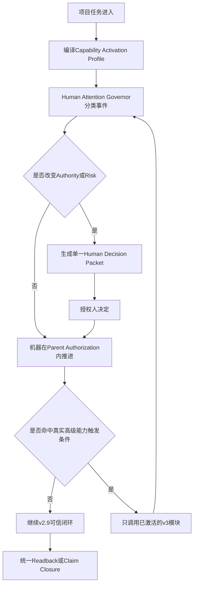
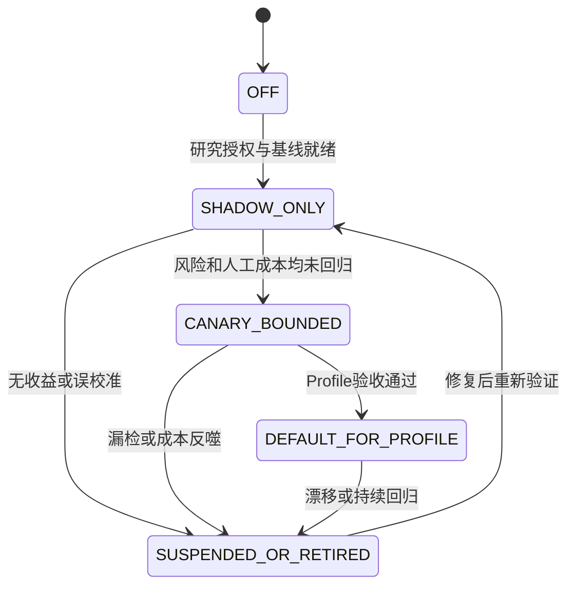

# Harness Foundry v3.0 后续智能架构与规模化治理提案

## 0. 文档信息

| 字段 | 内容 |
|---|---|
| 文档状态 | `FUTURE_PROPOSAL_R1_HUMAN_COST_CORRECTED_NOT_V2_9_GATE` |
| 前置版本 | Harness Foundry v2.9 Certified Release |
| 目标版本 | Harness Foundry v3.0 |
| 编写日期 | 2026-08-03 |
| 来源 | v2.9 R7范围纠偏后迁出的高级能力 |
| v2.9入口 | `HARNESS_FOUNDRY_V2_9_SEMANTIC_CONFORMANCE_UPGRADE_PLAN.md` |
| R7完整快照 | `HARNESS_FOUNDRY_V2_9_SEMANTIC_CONFORMANCE_UPGRADE_PLAN_R7_PRE_3_0_SPLIT_ARCHIVE.md` |
| v3.0 R0快照 | `HARNESS_FOUNDRY_V3_0_FOLLOW_ON_ARCHITECTURE_PLAN_R0_PRE_HUMAN_COST_REFACTOR_ARCHIVE.md` |
| 来源案例 | `HARNESS_FOUNDRY_V2_9_SOURCE_CASE_001.md`，仅作非规范输入 |
| 非授权声明 | 本文不授权实现、迁移、执行、安装、认证、发布或Git操作 |

## 1. 为什么需要独立v3.0

v2.9负责关闭最小可信执行闭环：

```text
意图和需求锁定
→ 生产架构锁定
→ 宪章执行
→ 风险授权
→ 自动推进
→ 可恢复执行
→ 按需证据
→ 可移植闭环
```

R7曾把大量平台化和研究型能力同时加入v2.9，造成36项目标、25个Gate、35个CLI入口、67类制品和44项发布验收。它们并非无价值，但会让v2.9重新出现人工门过多、链路过长、预算STOP和大爆炸式重构。

v3.0承接的问题不同：

> 当v2.9最小闭环已经稳定后，如何把它扩展为能够跨项目、跨控制域、跨设备和跨组织持续学习、优化和认证的平台。

因此v3.0是后续增强，不是v2.9完成条件。

R1进一步修正一个重要问题：高级能力本身也会产生控制税。更多Intent问题、Architecture候选、Policy审批、Agent、Phase、Validator、外部Signer和Dashboard，都可能把人工从“亲自执行”转移为“不断配置、确认、Review和等待”。因此v3.0不能以功能数量作为完成信号，而必须先证明：

```text
新增能力带来的风险降低和返工避免
>
新增机器成本 + 新增人工注意力 + 等待延迟 + 协调成本
```

v3.0的第一原则改为：

> 先管理人工注意力，再启用高级智能；Phase变化不产生人工Gate，只有Authority或Risk Delta才产生人工Gate。

## 2. 进入v3.0的边界与硬前提

### 2.1 非权威研究与Shadow实验入口

为了避免等到v2.9全部完成后才发现v3.0方向不经济，可以提前进行只读、离线和不接管控制流的研究：

- 使用复制或合成Evidence，不写回v2.8/v2.9权威状态；
- 不签署Certificate，不生成Authorization Source；
- 不控制真实Gate，不执行不可逆或外部副作用；
- 只比较“如果由新模块建议，会产生多少问题、多少误报、多少成本和多少正确决策”；
- 输出统一标记为`RESEARCH`或`SHADOW_ONLY`。

这类实验不等于启动v3.0正式Program，也不能宣称能力已实现。

### 2.2 正式接管与发布的硬前提

只有全部满足后，v3.0能力才可以接管真实控制流或进入正式发布：

1. v2.9 P0-01至P0-10已经实现并有Runtime Evidence；
2. Authoring和Runtime的自动推进在真实项目中通过；
3. 用户无需手工输入子Hash；
4. 全部规范性Charter Clause处置和执行闭环通过；
5. Checkpoint/Resume在预算和进程中断场景通过；
6. 至少一个非来源Target Profile证明Core不受案例污染；
7. v2.8和v2.9都有独立Certified Release Lock；
8. v3.0使用新的Program、State、Output、Authorization和Certificate链。

如果任一前提未满足，应回到v2.9修复，不得用v3.0能力绕过。

### 2.3 Phase不等于人工授权门

Phase只是工程实施和证据分组。一次明确的`Parent V3 Authorization`可以覆盖同一Scope、权限、预算和副作用围栏内的多个Phase，由机器生成`Derived Phase Grant`。仅当Requirement、Architecture、Policy Authority、权限、外发、Secret、真实目标、不可逆影响或预算上限发生Risk Delta时，才重新请求人工授权。

## 3. v3.0目标能力

| ID | 能力 | 价值 |
|---|---|---|
| `V3-01` | Adaptive Expert Intent Engine | 更少问题获得更高歧义消除和返工避免 |
| `V3-02` | Architecture Synthesis and Topology Optimizer | 自动比较多种Harness架构和风险/成本 |
| `V3-03` | Advanced Policy Formalization | 处理复杂自然语言Policy、冲突和证明 |
| `V3-04` | Distributed Durable Orchestration | 跨主机、长周期、多任务恢复与协调 |
| `V3-05` | Adaptive Review and Cost Router | 按风险、分歧和成本动态选Validator/模型/人工 |
| `V3-06` | External Certification Network | 支持L4外部组织、Provider和Signer |
| `V3-07` | Supply-chain and Protocol Portability | OCI、SBOM、SLSA、in-toto、MCP/A2A |
| `V3-08` | Platform Evolution Governance | Case-to-Core晋升、Canary矩阵和兼容演化 |
| `V3-09` | Cross-program Observability | 跨Program质量、成本、漂移和恢复分析 |
| `V3-10` | Policy and Architecture Learning Loop | 从历史Finding提议候选规则，但不自动升权 |

以上十项是能力目录，不是每个项目都必须启用的十个Gate。任何项目启用v3.0能力时，都必须使用V3-05的最小固定成本/注意力边界；V3-05的学习型路由部分仍须先经过Shadow。其余能力按`CAPABILITY_ACTIVATION_PROFILE`选择：

| 项目特征 | 默认启用 | 默认关闭 |
|---|---|---|
| 本地、可逆、单项目 | Intent辅助、Architecture候选、基础Review/Cost Router | 分布式、L4、完整供应链、跨项目学习 |
| 有网络、Secret或外发 | 增加权限差量与独立控制检查 | 与当前Claim无关的外部认证 |
| 多主机、长周期或跨Program | 增加Distributed Orchestration | 无触发条件的Protocol Federation |
| 正式对外发布 | 增加必要SBOM、Provenance和发布证明 | 运行期无关的全量供应链材料 |
| 法规、安全或高不可逆影响 | 按Claim增加L3/L4认证 | 全项目、全运行统一L4 |
| 多项目平台演进 | 增加Evolution和Cross-program Observability | 单案例自动晋升Core |

未被Profile激活的能力必须保持关闭；关闭任何v3.0能力都不能影响v2.9运行。

## 4. 总体架构

```text
v2.9 Trusted Execution Core
  ├─ Requirement / Architecture / Charter Locks
  ├─ Risk Authorization and Auto Progress
  ├─ Checkpoint / Resume
  └─ Evidence / Independent Closure
        ↓ stable extension APIs
Human Attention and Capability Control
  ├─ Human Attention Governor
  ├─ Capability Activation Profile
  ├─ Parent Authorization / Derived Phase Grant
  ├─ Decision Packet Compiler
  ├─ Shadow / Promotion Controller
  └─ Human Cost Ledger
        ↓ only activated modules
v3.0 Adaptive Control Plane
  ├─ Intent Intelligence
  ├─ Architecture Synthesis
  ├─ Policy Formalization
  ├─ Distributed Orchestration
  ├─ Adaptive Review and Cost Routing
  ├─ External Certification
  ├─ Supply-chain / Protocol Federation
  └─ Evolution and Observability
```

v3.0只能调用v2.9冻结的Extension API，不能重新定义v2.9的授权、状态、Clause处置和Claim Closure语义。

### 4.1 Human Attention Governor

`Human Attention Governor`不是新的产品Validator，而是控制“谁有权决定、是否需要打断人”的生产控制器。它把事件分为三类：

| 类别 | 例子 | 处理方式 |
|---|---|---|
| `MACHINE_CONTINUE` | Hash、Evidence收集、授权内修复、幂等重试、Phase推进 | 自动执行并记录Receipt |
| `CONDITIONAL_REVIEW` | 新颖案例、独立Oracle分歧、抽样审计命中、成本异常 | 先机器收敛；仍无法关闭时提交Decision Packet |
| `HUMAN_AUTHORITY_REQUIRED` | 需求含义、权限、外发、不可逆影响、Policy Waiver、最终高风险Promotion | 必须由授权人决定 |

禁止因为“进入新Phase”“产生新Artifact”“换了模型”或“内部检查完成”而自动产生人工Gate。

### 4.2 Human Decision Packet

任何人工请求必须压缩为一个可读决策包，至少包含：

```text
decision_required
why_human_authority_is_required
recommended_option
at_most_two_material_alternatives
assumptions_and_counterexamples
authority_and_risk_delta
cost_and_delay_delta
default_stop_or_reversible_fallback
supporting_evidence_refs
```

人工不输入子Hash，不阅读原始全量Trace，不负责跨Task搬运Artifact，也不批准机器内部实现细节。一个Packet默认只包含一个权威决定；多个独立决定必须拆分或在同一Readback中清楚分组。

### 4.3 Human Cost Non-regression Contract

每项v3.0能力进入Shadow、Canary或Default前必须声明：

- 新增和消除的人工动作；
- 预计人工中断、主动Review分钟和等待时间；
- 新增机器调用、Token、外部服务和协调成本；
- 预计减少的返工和风险；
- 关闭能力时的回退路径；
- 激活条件与自动下线条件。

普通Profile中，v3.0新增的常规人工中断必须为零；高风险Profile增加人工动作时，必须有显式`HUMAN_ATTENTION_BUDGET`和风险理由。

总成本采用：

```text
EXPECTED_TOTAL_COST
= machine_compute_and_tools
+ human_active_review
+ interruption_context_switch
+ waiting_latency
+ coordination_and_handoff
+ expected_rework
+ expected_residual_loss
```

不得仅以Token价格或单次模型调用价格声称“成本更低”。

### 4.4 Shadow、Canary与默认启用

高级能力必须经过：

```text
OFF
→ SHADOW_ONLY              # 给建议，不控制Gate
→ CANARY_BOUNDED           # 仅在限定Profile和预算内控制
→ DEFAULT_FOR_PROFILE      # 只对已证明受益的Profile默认
→ SUSPENDED_OR_RETIRED     # 成本反噬、漂移或失效时撤回
```

Shadow阶段同时记录新模块判断与v2.9真实结果；未证明人工负担和风险非回归前，不得晋升。

### 4.5 主控制流



### 4.6 能力生命周期状态机



## 5. Adaptive Expert Intent Engine

### 5.1 目标

在v2.9“最多三个高价值问题”的基础上，增加：

- Intent Hypothesis Set的概率或置信度维护；
- EVPI、风险、返工成本和打断成本联合排序；
- 根据用户经验动态调整问题粒度；
- 从历史项目提取反例候选；
- 跨轮次Decision Delta和冲突传播；
- 不同Architecture Candidate对问题价值的反馈。

提问排序不能只看模型认为“缺什么”，还必须同时看：

```text
task_relevance
× user_answerability
× decision_impact
× irreversibility
- interruption_cost
- information_available_from_local_evidence
```

能够从Repository、Requirement、历史Decision或工具中确定的事实先由机器查证。可逆且低风险的未知项使用显式`ASSUMPTION`继续，集中到Readback，不立即打断人。

### 5.2 边界

- 不把用户未纠正的假设升级为事实；
- 不输出或要求隐藏Chain-of-Thought；
- 只输出可审核的假设、证据、取舍、问题和Decision Record；
- 低风险问题可以延后，但高关键冲突不能由概率覆盖；
- 所有学习结果只形成候选，不直接改变冻结Requirement；
- 一个交互轮次默认最多提交三个问题；能合并为一个选择卡的问题不得拆成多次打断；
- 问题必须是用户能够理解和回答的产品、取舍或风险问题，不能把内部类名、Hash或形式Policy表达式转嫁给用户；
- 已有答案未发生Decision Delta时不得重复询问。

### 5.3 验收方向

- 与固定问题集相比，Blocking歧义关闭率不降低；
- 人工轮次和返工率下降；
- 高关键问题召回率可测；
- 对错误历史案例的迁移不会污染新Target；
- 用户可以查看为何当前问题优先，而无需查看模型隐藏推理；
- `questions_per_closed_blocking_ambiguity`和`unanswerable_question_rate`优于固定问题集；
- 相比v2.9基线，人工中断次数和主动回答时间不增加。

## 6. Architecture Synthesis and Topology Optimizer

v2.9只要求发现缺口、提出有限候选并由用户Lock。v3.0增加：

1. 从Capability/Behavior/State自动生成多种Architecture Candidate；
2. 比较Stage、Module、Subharness和Semantic Slot的替代拓扑；
3. 估计控制流复杂度、恢复面、共同失效、成本和延迟；
4. 进行Architecture Counterexample和故障注入；
5. 识别可删除、合并或参数化的节点；
6. 在多个Target Profile之间验证拓扑通用性；
7. 生成`CONTROL_FLOW_DELTA`和演化影响。

Optimizer不能自行批准Architecture Lock。它只能提交：

```text
Candidate
+ Assumptions
+ Tradeoffs
+ Evidence
+ Unresolved Decisions
+ Migration Impact
```

### 6.1 减少Architecture Review成本

Optimizer不得把所有候选完整交给人比较。它必须先区分：

- `REVERSIBLE_TECHNICAL_CHOICE`：在冻结Requirement、Policy和Authorization内可回滚的实现细节，由机器选择并通过Canary验证；
- `MATERIAL_ARCHITECTURE_DECISION`：改变State Owner、权限、外部依赖、失败语义、不可逆影响或长期兼容性的选择，进入Human Decision Packet；
- `REQUIREMENT_CHANGE_DISGUISED_AS_ARCHITECTURE`：实际改变产品含义，返回Requirement层重新决定。

人工Packet只展示推荐方案、最多两个具有实质差异的替代方案，以及它们在权限、恢复、成本和兼容性上的差量。只是内部节点命名、等价模块拆合或可自动回滚的选择不得要求人工批准。

## 7. Advanced Policy Formalization

v2.9保留全量Clause处置和确定性执行；v3.0研究并实现：

- 自然语言Clause到形式Policy的多候选编译；
- Policy语义等价检查和反例生成；
- 多Policy Bundle冲突求解；
- Temporal Policy、跨阶段Policy和外部法规绑定；
- Policy作者、测试者、执行者和Signer分离；
- Policy变更影响和最小失效子图；
- 外部Policy Engine和透明Decision Log；
- Policy自动形式化的置信度与人工批准路由。

任何自动形式化输出在批准前均为`POLICY_CANDIDATE`，不能成为Authorization Source。

### 7.1 可理解的Policy Review

人工不直接审核完整Policy IR。系统必须将候选Policy投影为：

- 原始Clause与中文释义；
- 允许、拒绝、要求人工和不适用的代表性例子；
- 与已批准Policy相比的语义差量；
- 反例、冲突和影响的Claim；
- 哪些已有Authorization或Result会失效。

不变Clause按Hash引用复用；同一Policy Bundle的机械重编译不产生新人工门。只有Authority语义变化、冲突无法确定性解决、Waiver或高影响Policy Promotion需要人工Freeze。

## 8. Distributed Durable Orchestration

v2.9只要求单Program可靠恢复。v3.0可增加：

- 多主机Event Store复制；
- Lease、Heartbeat和Worker故障转移；
- 跨Program依赖和Saga补偿；
- 外部Activity的长周期Reconciliation；
- 跨控制域Signal/Update；
- 分布式幂等键和Exactly-once Claim边界；
- 长任务的分片Checkpoint；
- 多任务资源和成本预算协调；
- 人工等待期间的授权/环境漂移监控。

分布式能力不能弱化v2.9的单一权威状态、Hash绑定、授权过期和未知副作用Fail-closed。

分布式能力仅在多主机、跨Program依赖、长周期外部Activity或单机恢复不足时激活。普通单Program不得为了“未来扩展”承担分布式运维和人工排障成本。

Phase、Worker和分片在同一Parent Authorization内由机器签发Derived Grant，不逐项找人。Runtime不得笼统声称外部副作用`exactly once`；应声明实际采用的at-least-once、幂等键、去重Receipt、Reconciliation和未知副作用人工返回边界。

## 9. Adaptive Review and Cost Router

本模块前移为所有v3.0高级能力的基础控制面。其他模块在Router完成v2.9基线测量、Shadow校准和Human Cost Non-regression前，不得成为Default。

### 9.0 优化目标与硬约束

Router的目标不是“用更少的钱做更多检查”，而是在不可降低的Policy和Evidence Floor下最小化总预期成本：

```text
minimize EXPECTED_TOTAL_COST
subject to:
  authority_boundary_preserved
  mandatory_policy_not_downgraded
  claim_specific_evidence_floor_met
  human_attention_budget_not_exceeded
  residual_risk_within_profile_limit
```

Router不能同时定义硬性Evidence Floor并为了省钱修改该Floor。硬性义务由冻结Policy和Claim Profile决定；Router只在允许的选择空间内分配工具、模型、抽样和人工注意力。

### 9.1 输入信号

```text
risk_delta
+ irreversibility
+ policy_unknown
+ intent_uncertainty
+ validator_disagreement
+ common_mode_risk
+ expected_information_gain
+ latency_and_cost
+ deterministic_failure
+ novelty_or_out_of_distribution
+ historical_defect_rate
+ random_audit_trigger
```

`intent_uncertainty`或模型语言化confidence只能作为弱信号。Router不得仅凭生产模型或Validator自报“高置信”跳过人工、独立Oracle或抽样审计。

### 9.2 可选路由

- deterministic check；
- lightweight model/tool；
- stronger model；
- second independent implementation；
- heterogeneous Provider；
- internal human；
- external certifier。

默认采用分层策略：

1. 冻结Policy决定不可省略的义务；
2. 确定性检查关闭可以机械判断的问题；
3. 低成本语义工具处理已知Profile；
4. 新颖性、真实分歧或随机抽样触发更强Oracle；
5. 仅Authority、Risk Delta或无法关闭的高影响分歧进入人工。

### 9.3 防止成本反噬

- 先确定性后语义；
- 只有风险和分歧证明升级有价值时才增加昂贵Oracle；
- 预算达到上限提交Checkpoint，不以“还差一点”无限延长；
- Router的成本预测和真实消耗必须回读；
- Router不能降低v2.9硬性Policy或Evidence义务。

### 9.4 Human Attention Budget与成本指标

每个Profile必须声明：

| 指标 | 含义 | 普通Profile约束 |
|---|---|---|
| `human_interrupt_count` | 运行中主动打断人的次数 | v3.0增量为0 |
| `human_active_review_minutes` | 人实际阅读和决策时间 | 不高于v2.9基线 |
| `decision_items_per_packet` | 单个Packet内独立决定数 | 默认为1 |
| `false_escalation_rate` | 找人后没有产生有效Decision Delta | 必须持续下降 |
| `escalation_yield` | 人工介入真正改变结果或授权的比例 | 必须记录并设Profile阈值 |
| `waiting_for_human_time` | 因等待人导致的停滞 | 不计入机器执行时间并单独报告 |
| `duplicate_review_rate` | 同一事实被重复审核的比例 | 不变内容Hash复用，目标为0 |
| `random_audit_escape_rate` | 抽样审计发现本应拦截问题的比例 | 触发Router降级或暂停 |
| `rework_after_approval_rate` | 人工批准后仍因同一根因返工 | 触发Decision Packet或生产设计修复 |

普通本地可逆Profile默认不增加中途人工Gate；高风险Profile可以增加，但必须在Parent Authorization中写明次数、主动Review分钟和超限处理。

### 9.5 Shadow校准、随机审计与失效处理

- Shadow阶段不控制真实Gate，只比较建议与v2.9真实结果；
- 使用分层随机审计发现“所有模型都很自信但一起错误”的盲区；
- 依照Capability Tier、Provider/实现来源、任务难度和历史错误聚类分配审计预算；
- Router被证实误校准、成本预测持续偏差或漏过硬风险时，自动降级到固定v2.9规则；
- Router自身的Policy、模型、阈值和训练数据变化属于控制面变化，必须独立验证并按风险重新授权；
- 不允许Router通过频繁升级到更强模型或更多Agent来掩盖生产架构缺陷。

## 10. External Certification Network

v3.0扩展独立性等级：

| 等级 | 条件 |
|---|---|
| `L2_COORDINATED` | 独立上下文/workspace/state，但可能模型和实现同源 |
| `L3_INTERNAL_AUTHORITY` | 独立顶层任务、Credential、Signer、Validator和发布权 |
| `L4_EXTERNAL` | 外部组织、Provider、基础设施或人工审计机构 |

v3.0需要：

- 外部Task Envelope和不可变Artifact Exchange；
- 独立Fixture、Oracle和Signer登记；
- 相关错误风险评估；
- 多Oracle的`ALL_OF / QUORUM / DISAGREEMENT_STOP`；
- Certificate中记录独立性向量和残余共同失效；
- 外部结果不可被父Orchestrator改写或选择性丢弃。

不同模型、不同Prompt或复制Validator仍不能单独证明独立。

### 10.1 Claim-specific Certification

独立性等级绑定具体Claim，而不是整个项目统一升级：

| Claim类型 | 默认闭环 |
|---|---|
| 结构、Schema、Hash和确定性构建 | 确定性工具，不默认启用外部人或模型 |
| 一般行为与语义输出 | 内部独立控制域或按Profile抽样 |
| 高风险发布、权限和安全Claim | L3独立顶层任务、State、Credential、Signer和Validator实现 |
| 法规、跨组织或重大不可逆影响 | 经明确Profile激活的L4外部认证 |

Subagent、同一Chat换Prompt或复制Validator只用于协同检查，不产生更高独立性声明。真正Claim-bearing的认证结果必须由独立顶层任务产生，父Orchestrator只能调度和展示，不得代签、改写、选择性丢弃或要求用户手工搬运结果。无法提供所需独立域时，降级Claim并明确残余风险，不用额外人工Review伪装独立。

## 11. Supply-chain and Protocol Portability

v3.0在v2.9 clean-clone基础上增加：

- SBOM与依赖透明；
- SLSA构建等级和Provenance；
- in-toto布局和步骤证明；
- OCI镜像/Artifact身份；
- 可验证构建和透明日志；
- 跨OS/架构发布矩阵；
- MCP Resource URI、Tool Schema和Server Capability协商；
- A2A Task、Message和Artifact交接；
- 插件发现、版本、权限和Secret Scope；
- 离线、降级和Provider替换合同。

容器、GitHub上传或协议兼容本身都不等于可信认证，仍需v2.9授权、执行、证据和Claim Closure。

供应链能力按发布边界启用，而不是每个开发Attempt都要求人工阅读SBOM、Provenance或in-toto布局。机器自动生成和验证不变材料；只有新增依赖、未知许可证、未声明外部服务、Provenance断裂、Secret Scope变化或发布目标变化时生成Decision Packet。MCP/A2A Server和Tool数量必须按任务最小化，未使用能力不得注入上下文或扩大权限面。

## 12. Platform Evolution Governance

### 12.1 Case-to-Core Promotion

案例Finding必须先分类：

- `PLATFORM_INVARIANT_DEFECT`；
- `PROFILE_VARIATION`；
- `IMPLEMENTATION_DEFECT`；
- `FIXTURE_OR_ORACLE_DEFECT`；
- `NO_CHANGE_REQUIRED`。

进入Core的候选至少满足：

- 领域无关不变量可形式化；
- 或在两个非来源、互不相似Profile独立复现；
- 或属于显式批准的安全/权限例外。

候选不得逐Finding实时打断人。系统必须先去重、聚类、验证跨Profile复现、执行Case Ablation并计算预期收益，在约定周期内批量形成一个Promotion Packet。低复现、低收益、已有规则可覆盖或增加人工成本的候选自动留在Profile或关闭。

### 12.2 Canary Property Matrix

Canary按性质而非故事组织：

- structural identity；
- deterministic runtime behavior；
- semantic structured output；
- generative portfolio；
- permission and denial；
- migration and compatibility；
- portability；
- recovery；
- common-mode failure。

### 12.3 演化合同

每次Core变化输出：

- Extension API Delta；
- Control Flow Delta；
- State/Schema Migration；
- Profile Compatibility；
- Case Ablation；
- Cost/Latency Delta；
- Rollback Plan；
- Deprecated Path Removal。

每个新规则、Architecture Pattern和Capability还必须声明：

- `activation_profile`；
- `human_action_added`与`human_action_retired`；
- `shadow_evidence`；
- `cost_latency_delta`；
- `suspension_trigger`；
- `sunset_or_removal_condition`。

## 13. Cross-program Observability

v3.0可以建立跨Program只读分析面：

- Requirement到生产路径缺口率；
- Charter Clause执行与Unknown率；
- 自动推进距离和人工门原因；
- Checkpoint恢复成功率；
- Validator分歧和共同失效；
- Evidence体积、重复率和Hash复用；
- 模型/工具成本与升级收益；
- Profile和Core演化影响；
- Release与回滚质量。

Observability不得成为新的权威状态库，不得修改Program结果或替代独立证据。

默认用户界面不是持续监控Dashboard，而是异常摘要和周期性Digest。只有超过Profile阈值、成本回归、权限异常、恢复失败、共同失效聚类或Promotion候选达到批量条件时通知人。人工注意力指标必须与模型/工具成本同等展示，禁止只报告“自动化处理了多少任务”而隐藏人工中断、等待和返工。

## 14. v3.0制品和入口原则

v3.0仍应优先使用Bundle和组合入口，避免重建R7的67类操作者制品与35个CLI入口。

建议逻辑Bundle：

- `INTENT_INTELLIGENCE_BUNDLE`；
- `ARCHITECTURE_SYNTHESIS_BUNDLE`；
- `POLICY_FORMALIZATION_BUNDLE`；
- `DISTRIBUTED_ORCHESTRATION_BUNDLE`；
- `REVIEW_COST_ROUTING_BUNDLE`；
- `EXTERNAL_CERTIFICATION_BUNDLE`；
- `SUPPLY_CHAIN_PROTOCOL_BUNDLE`；
- `EVOLUTION_OBSERVABILITY_BUNDLE`。

每个Bundle内部可有机器制品，但默认只暴露：

```text
v3 plan
v3 advance-until-gate
v3 explain-decision
v3 inspect-evidence
v3 resume
```

新增CLI必须证明不能由组合入口或`--detail`承载。

`CAPABILITY_ACTIVATION_PROFILE`、`HUMAN_ATTENTION_BUDGET`、`HUMAN_DECISION_PACKET`、`HUMAN_COST_LEDGER`和Shadow比较结果作为现有Bundle内的机器制品，不再新增五个操作者Bundle或五个CLI。默认入口只显示下一项真实人工决定、激活能力、成本差量和停止原因；详细Hash与Trace使用`inspect-evidence`按需展开。

## 15. v3.0发布验收方向

v3.0发布前至少证明：

1. 不改变v2.9 P0 Gate、授权和Claim语义；
2. 所有高级能力可以关闭而不影响v2.9运行；
3. Adaptive Intent降低人工轮次且不降低Blocking歧义召回；
4. Architecture Optimizer不会自动批准或扩大Scope；
5. Policy自动形式化不会绕过全量Clause处置和人工Freeze；
6. 分布式恢复不会重复非幂等副作用；
7. Review Router不会降低硬性Evidence/Policy要求；
8. L4外部结果具有独立Signer和不可变交接；
9. Supply-chain证明可跨设备和独立进程验证；
10. Case-to-Core Promotion能拒绝单案例直接升Core；
11. Observability保持只读且不成为第二权威状态；
12. 成本、延迟、证据体积和人工负担不高于声明预算；
13. Human Attention Governor只在Authority、Risk Delta或无法关闭的高影响分歧时打断人；
14. Phase变化、内部Artifact变化和模型切换不会自行生成新人工Gate；
15. 普通Profile的v3.0增量人工中断为0，主动Review时间不高于v2.9基线；
16. 每个人工请求都能生成单一决定、可理解且含可逆回退的Decision Packet；
17. Intent问题同时满足任务相关性和用户可回答性，且不重复已知答案；
18. Router不使用模型自报置信作为唯一降级或免审依据，并有分层随机审计；
19. Router在Shadow和Canary阶段证明风险、人工与总成本非回归后才进入Profile默认；
20. Parent Authorization内的Phase、Worker和Attempt使用Derived Grant，不要求逐项人工授权；
21. L3/L4按Claim激活，Subagent或同Chat结果不冒充独立认证；
22. 未激活能力不注入上下文、不扩大权限、不消耗外部服务；
23. 每个高级能力都有暂停、降级、下线和v2.9固定规则回退；
24. v2.9 Compatibility和Rollback通过；
25. 所有研究性Claim与真实生产证据分开标注。

## 16. R7 Scope Migration Matrix

本矩阵覆盖R7全部41个顶层章节（含第0章）。`KEEP_2_9`表示保留在R8；`SPLIT`表示最小部分留在2.9、高级部分进入3.0；`MOVE_3_0`表示不再阻塞2.9；`ARCHIVE`表示仅保留历史或案例证据。

| R7章节 | 处置 | v2.9 R8去向 | v3.0去向 |
|---|---|---|---|
| 0 文档信息 | `KEEP_2_9` | R8元数据与边界 | 本文元数据 |
| 1 执行摘要 | `SPLIT` | 最小可信闭环 | 规模化智能控制面 |
| 2 当前能力与边界 | `KEEP_2_9` | v2.8→2.9差距 | v3进入条件 |
| 3 来源案例抽象 | `ARCHIVE` | 只保留Case不能改Core | SOURCE_CASE_001 |
| 4 通用根因 | `KEEP_2_9` | 生产、Policy、自动推进根因 | 跨Program演化分析 |
| 5 升级目标 | `SPLIT` | P0-01至P0-10 | V3-01至V3-10 |
| 6 目标架构 | `SPLIT` | 双锁、Policy、Auto Progress | Adaptive Control Plane |
| 7 Requirement类型 | `KEEP_2_9` | 按需分类 | 跨Profile分析 |
| 8 Evidence Obligation | `SPLIT` | 最低兼容性 | 多Oracle和成本优化 |
| 9 Independent Oracle | `SPLIT` | 内部独立最低要求 | L4外部Oracle网络 |
| 10 Runtime Topology | `SPLIT` | Profile声明、Core不固定 | Topology Optimizer |
| 11 Coverage Graph | `KEEP_2_9` | Requirement→Run→Evidence | 跨Program图分析 |
| 12 Factory门禁 | `SPLIT` | 合并为8个Gate | 高级Gate内部策略 |
| 13 状态机 | `SPLIT` | 精简Authoring/Runtime状态 | 分布式状态和Saga |
| 14 CLI升级 | `SPLIT` | 10个组合入口 | 5个v3组合入口 |
| 15 Finding类型 | `SPLIT` | P0 Finding | 演化、外部认证和优化Finding |
| 16 新增制品 | `SPLIT` | 8个逻辑Bundle | 8个高级Bundle |
| 17 正规执行 | `KEEP_2_9` | 风险授权、自动推进、恢复 | 跨域调度 |
| 18 Golden Canary | `SPLIT` | 最小Applicability Canary | Property Matrix |
| 19 测试策略 | `SPLIT` | P0单元/E2E | 高级对抗和跨域测试 |
| 20 迁移方案 | `KEEP_2_9` | v2.8隔离迁移 | v2.9→v3.0迁移 |
| 21 兼容策略 | `KEEP_2_9` | 不静默升级 | v3兼容/回滚 |
| 22 验收标准 | `SPLIT` | 18项P0验收 | 25项v3验收方向 |
| 23 风险与控制 | `SPLIT` | P0风险 | 平台规模化风险 |
| 24 回溯证据 | `ARCHIVE` | 非规范来源指针 | Evolution输入候选 |
| 25 实施顺序 | `SPLIT` | 12步P0 | v3阶段路线 |
| 26 最终原则 | `KEEP_2_9` | 最小可信闭环原则 | 不覆盖v2.9原则 |
| 27 关联文档影响 | `ARCHIVE` | R7历史快照 | 本矩阵替代 |
| 28 最新研究复核 | `MOVE_3_0` | 不作2.9 Gate | v3研究和实验依据 |
| 29 宪章/Review/预算 | `SPLIT` | 全量Clause、固定风险门、Resume | Human Attention Governor、自动形式化、Shadow Router与成本非回归 |
| 30 Expert Chat | `SPLIT` | 最多3个高价值问题 | 任务相关性、用户可回答性、EVPI、学习型提问和反例库 |
| 31 GitHub可发布 | `SPLIT` | clean clone与Manifest | SBOM/SLSA/OCI/MCP/A2A |
| 32 增加其他工程 | `SPLIT` | 不按数量增加工程 | Risk-driven物理拓扑优化 |
| 33 三CLI独立性 | `SPLIT` | L2/L3诚实声明 | L4外部网络 |
| 34 隔离启动 | `KEEP_2_9` | 新根、零回写 | v3独立新Epoch |
| 35 研究与规范来源 | `MOVE_3_0` | 仅保留必要原则 | 研究登记与实验计划 |
| 36 生产架构优先 | `KEEP_2_9` | Production-first Repair | 跨项目优化 |
| 37 Freeze后架构设计 | `SPLIT` | Architecture Lock与有限候选 | 自动综合和Optimizer |
| 38 同Chat独立 | `SPLIT` | 不伪称独立、L3内部认证 | L4外部认证 |
| 39 Profile交接 | `SPLIT` | Rule/Profile Freeze | 学习和晋升治理 |
| 40 案例去偏置 | `SPLIT` | Profile不改Core、Ablation | Case-to-Core Promotion和演化 |

### 16.1 覆盖结果

| 指标 | 结果 |
|---|---:|
| R7顶层章节 | 41 |
| 已映射章节 | 41 |
| 未映射章节 | 0 |
| 静默删除 | 0 |
| v2.9 P0保留或拆分 | 36 |
| 完全迁入v3.0 | 2 |
| 历史/案例归档 | 3 |

R7原始细节仍完整保存在R7历史快照；来源案例仍完整保存在SOURCE_CASE_001。迁移不代表对应能力已经实现。

## 17. v2.9与v3.0的强边界

| 问题 | v2.9回答 | v3.0回答 |
|---|---|---|
| 怎样少问但不漏关键需求 | 最多3个高价值问题 | 学习型EVPI与用户模型 |
| 怎样设计Harness | 有限候选+人工Architecture Lock | 自动综合和拓扑优化 |
| 怎样执行宪章 | 全量Clause+确定性Policy | 高级自动形式化和冲突证明 |
| 怎样不中断 | 单Program Checkpoint/Resume | 分布式多任务编排 |
| 怎样减少人工Review | 固定风险规则 | Adaptive Review Router |
| 怎样证明独立 | 内部L3 | 外部L4网络 |
| 怎样跨设备发布 | clean clone+Manifest | 完整供应链和协议联邦 |
| 怎样避免案例污染 | Profile不改Core+Ablation | 自动晋升和平台演化治理 |
| 怎样避免3.0增加人工 | 风险差量与自动推进基线 | Human Attention Governor、Decision Packet、Shadow与成本非回归 |
| 怎样决定启用哪些能力 | P0最小闭环固定存在 | Capability Activation Profile按项目触发 |

任何v3.0实现不得被反向描述成v2.9已完成能力。

## 18. 建议阶段

```text
Phase 0  Verify v2.9 Certified Baseline
Phase 1  Measure v2.9 Human Attention and Total-cost Baseline
Phase 2  Human Attention Governor and Router in SHADOW_ONLY
Phase 3  Capability Activation and Decision Packet CANARY_BOUNDED
Phase 4  Intent and Architecture Intelligence for approved Profiles
Phase 5  Optional Policy or Distributed Orchestration by actual trigger
Phase 6  Optional Claim-specific External Certification and Supply-chain
Phase 7  Evolution Governance after sufficient cross-Program evidence
Phase 8  v3.0 Release Candidate, Cost Non-regression and Rollback Validation
```

一个Parent Authorization可以覆盖同一Scope、权限、预算和副作用围栏内的多个Phase；机器为每个Phase生成Derived Grant和独立Evidence。Phase本身不是人工Gate。只有Authority或Risk Delta才重新授权。不得用创建v3.0文档授权实际执行。

## 19. 主要风险

| 风险 | 控制 |
|---|---|
| v3.0再次变成大爆炸 | 各能力可关闭、分Phase验收，不阻塞v2.9 |
| 高级能力把人工执行变成人工治理 | Human Cost Non-regression、Attention Budget、Decision Packet和默认关闭 |
| Cost Router自身成为昂贵第二控制层 | 前移Shadow校准、固定Policy Floor、可一键降级v2.9规则 |
| 每个Phase重复授权 | Parent Authorization与Derived Phase Grant，Phase不等于Gate |
| 自动架构覆盖用户决定 | Candidate-only，Architecture Lock仍需批准 |
| Policy自动形式化产生假等价 | 多候选、反例、独立测试和人工Freeze |
| 分布式状态形成多个真相 | v2.9权威Event语义不变，复制层不可改写历史 |
| Review Router为省钱降低质量 | 硬Evidence和Policy不可降级 |
| 多Provider仍相关错误 | 独立实现、确定性Oracle、权限和Signer优先 |
| 模型高置信但共同错误 | 自报置信仅作弱信号、分层随机审计和历史校准 |
| Subagent增加Token和协调开销 | 默认用于有界只读并行，Claim认证使用按需独立顶层任务 |
| 供应链制品爆炸 | 逻辑Bundle、Hash引用和分层回读 |
| 案例自动晋升污染Core | 多Profile复现、Ablation和Architecture批准 |
| Observability变成第二状态库 | 只读、可重建、不参与Promotion |
| Dashboard和规则候选形成新人工队列 | 异常Digest、批量Promotion、去重聚类和下线条件 |
| 研究结论被写成已实现 | 区分`RESEARCH`、`EXPERIMENT`、`IMPLEMENTED`、`CERTIFIED` |

## 20. 研究和工程参考方向

以下只支持v3.0研究，不是实现或认证证据：

- [Agent Harness Engineering Survey](https://openreview.net/forum?id=eONq7FdiHa)：生命周期、上下文、工具和控制流的分层；
- [LLM-as-Code Agentic Programming](https://arxiv.org/abs/2606.15874)：确定性程序持有循环、分支和停止；
- [Correlated Errors in Large Language Models](https://arxiv.org/abs/2506.07962)：不同模型和Provider仍可能共享错误；
- [Asking What Matters](https://arxiv.org/abs/2604.14624)：有效澄清同时考虑任务相关性和用户可回答性，在其评测中以更少问题维持歧义解决能力；
- [One Human, N Agents](https://arxiv.org/abs/2607.28317)：模型自报置信可能严重失准，相关错误和有限审计预算会使置信排序审计失效；
- [Control Tax](https://arxiv.org/abs/2506.05296)：控制协议必须同时计算安全收益、机器开销和运营成本；
- [The Price of Over-Delegation](https://openreview.net/forum?id=oR9NEviIsX)：多Agent交接可能产生上下文损失、责任扩散和审核开销，支持按收益而非数量拆分；
- [Codex Subagents](https://learn.chatgpt.com/docs/agent-configuration/subagents)：Subagent适合有界并行，但会增加Token，写密集并行还会增加协调开销；
- [Codex Auto-review](https://learn.chatgpt.com/docs/sandboxing/auto-review)：自动Review是Reviewer替换而不是权限扩大，应先修正常见安全工作流的边界，避免长期审核噪音；
- [Temporal Durable Execution](https://temporal.io/)：Event、Activity、Signal、Heartbeat和恢复；
- [Open Policy Agent](https://www.openpolicyagent.org/docs)：Policy Decision与Enforcement参考；
- [SLSA](https://slsa.dev/)与[in-toto](https://in-toto.io/)：供应链身份、构建来源和步骤证明；
- [MCP Tools Specification](https://modelcontextprotocol.io/specification/2025-06-18/server/tools)与[A2A Specification](https://a2aproject.github.io/A2A/latest/specification/)：Resource/Tool和Task/Artifact互操作。

采用任何研究结果前必须建立Target-specific实验、负向测试和成本边界。

## 21. 最终原则与非声明

```text
v2.9 closes the trustworthy loop.
v3.0 scales, learns and federates it.
No v3 feature may weaken v2.9 authority, authorization or evidence.
Advanced intelligence proposes; frozen policy and humans authorize.
Human attention is a bounded authority resource, not a default fallback.
Phase transitions do not create human gates; authority and risk deltas do.
Optional capabilities remain off until profile activation and shadow evidence.
Every human request is a readable decision packet, not a raw trace or hash list.
Distributed execution must preserve one authoritative history.
More models, agents and projects do not automatically create independence.
Evolution is allowed only with traceable migration and rollback.
```

## 22. 通俗词汇与一次完整运行示例

| 技术词 | 通俗解释 |
|---|---|
| Human Attention Governor | 总控秘书：先判断是否真的需要打断人 |
| Capability Activation Profile | 项目套餐：只开启真正需要的高级能力 |
| Parent Authorization | 总授权：在确定范围、权限和预算内可以连续工作 |
| Derived Phase Grant | 机器在总授权内签发的阶段通行证 |
| Decision Packet | 一页决策单：告诉人决定什么、为什么、差量和不回答时怎么办 |
| Shadow Mode | 实习观察期：模块只给建议，不控制真实流程 |
| Canary | 小范围试运行：只在限定Profile和预算内获得控制权 |
| Cost Router | 分诊台：在固定安全底线内选择工具、模型、抽样或人工 |
| Claim-specific L3/L4 | 只为某项高风险声明增加独立认证，不把整个项目全部升级 |

普通本地项目示例：

```text
用户给出目标
→ v2.9冻结Requirement和Architecture
→ v3.0编译Profile，只启用Intent辅助、Architecture候选和Shadow Router
→ Router从本地证据关闭可确定问题
→ 可逆Architecture细节由机器选择并Canary
→ 用户只收到一次真正Blocking的Decision Packet
→ 一次Parent Authorization覆盖后续本地Phase
→ Phase、Attempt、Hash、Evidence、Checkpoint由机器处理
→ 没有权限或不可逆风险变化，不再中途打断
→ 最终统一Readback；L4、分布式和完整供应链保持关闭
```

如果任务后来要求上传GitHub，才产生一次Risk Delta Packet，说明新增外发、目标Repository、Secret Scope、成本和可逆回退。系统不因为“进入发布Phase”而自动要求授权，而是因为外部影响实际改变才要求授权。

## 23. R0到R1无损覆盖矩阵

| R0章节 | R1处置 | R1结果 |
|---|---|---|
| 0 文档信息 | `KEEP_AUGMENT` | 更新状态并增加R0历史快照指针 |
| 1 为什么需要v3.0 | `KEEP_AUGMENT` | 保留版本边界，增加Control Tax根因 |
| 2 进入硬前提 | `SPLIT_AUGMENT` | 正式接管前提保留，新增非权威Shadow实验入口和Phase非Gate规则 |
| 3 十项目标能力 | `KEEP_AUGMENT` | V3-01至V3-10全部保留，增加按Profile激活 |
| 4 总体架构 | `KEEP_AUGMENT` | 增加Human Attention、Decision Packet、成本账本和能力生命周期 |
| 5 Adaptive Intent | `KEEP_AUGMENT` | 增加任务相关性、用户可回答性、问题预算和非重复 |
| 6 Architecture Optimizer | `KEEP_AUGMENT` | 增加可逆技术选择、实质架构决定和伪装需求变化分类 |
| 7 Policy Formalization | `KEEP_AUGMENT` | 增加中文释义、例子、差量和不变Policy复用 |
| 8 Distributed Orchestration | `KEEP_AUGMENT` | 增加实际触发、Derived Grant和外部副作用语义 |
| 9 Review and Cost Router | `STRENGTHEN_REORDER` | 前移为基础控制面，增加硬Floor、Shadow、随机审计和人工预算 |
| 10 External Certification | `KEEP_REFINE` | 等级全部保留，改为Claim-specific并限制同Chat伪独立 |
| 11 Supply-chain | `KEEP_REFINE` | 原能力全部保留，改为发布边界按需激活和差量Review |
| 12 Evolution Governance | `KEEP_AUGMENT` | 增加批量Promotion、人工动作账本和下线条件 |
| 13 Observability | `KEEP_AUGMENT` | 保持只读，增加异常Digest和人工注意力指标 |
| 14 Bundle与入口 | `KEEP_AUGMENT` | 八Bundle和五入口保留，新增控制制品不扩CLI |
| 15 发布验收 | `KEEP_EXPAND` | 原14项保留并扩为25项，增加人工成本非回归 |
| 16 R7迁移矩阵 | `KEEP_CORRECT` | 41章映射全部保留并修正正文计数 |
| 17 v2.9/v3.0边界 | `KEEP_AUGMENT` | 增加人工成本和能力激活边界 |
| 18 建议阶段 | `REORDER` | 原能力阶段全部保留，Router和成本基线前移 |
| 19 主要风险 | `KEEP_EXPAND` | 原风险保留，增加治理成本、误校准和人工队列风险 |
| 20 研究参考 | `KEEP_EXPAND` | 原来源保留，增加人工成本、澄清、审计和Codex官方资料 |
| 21 最终原则 | `KEEP_AUGMENT` | 原原则保留，增加Attention、Profile、Phase和Decision Packet原则 |
| 22 通俗词汇与示例 | `NEW` | 为非工程背景读者增加学习入口 |

覆盖结果：R0的22个顶层章节全部映射，未映射0，静默删除0。R0完整正文保存在`HARNESS_FOUNDRY_V3_0_FOLLOW_ON_ARCHITECTURE_PLAN_R0_PRE_HUMAN_COST_REFACTOR_ARCHIVE.md`。

本文是`FUTURE_PROPOSAL_R1_HUMAN_COST_CORRECTED_NOT_V2_9_GATE`。它不证明v3.0能力已实现，也不授权开始v3.0 Program、执行、迁移、发布或认证。
